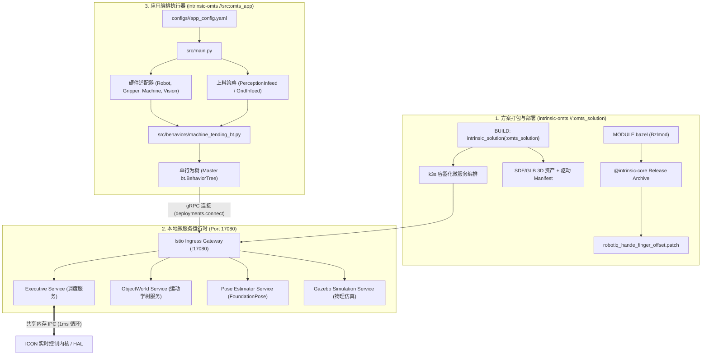
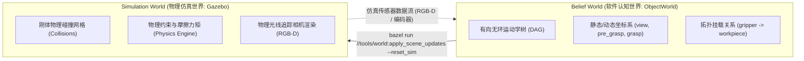

# Intrinsic Core & OMTS 机器人项目完整接手与部署实战手册 (终极深度架构版)

> **文档版本**: 3.0 (源码与架构深度剖析版)  
> **适用版本**: Intrinsic Core `20260922.0` / OMTS `20260922.0`  
> **适用平台**: Linux x86_64 (Ubuntu 24.04 LTS / Ubuntu 26.04 LTS)  
> **目标工程**: [intrinsic-core](file:///home/eric/Documents/Code/robot/intrinsic-core) & [intrinsic-omts](file:///home/eric/Documents/Code/robot/intrinsic-omts)  
> **前置状态**: ✅ Git LFS 3D 模型资产已 100% 补全；✅ Bazel 构建缓存与临时目录已重定向至 `/media/eric/Apps`

---

## 目录
1. [开发机环境与存储现状（已配置状态）](#1-开发机环境与存储现状已配置状态)
2. [项目全景概览与核心技术栈](#2-项目全景概览与核心技术栈)
3. [系统整体架构与底层通信机制深度解析](#3-系统整体架构与底层通信机制深度解析)
   - [3.1 端到端解耦架构拓扑与生命周期](#31-端到端解耦架构拓扑与生命周期)
   - [3.2 三层通信机制全景：gRPC 控制面、ICON 共享内存数据面与 Zenoh-C 中间件](#32-三层通信机制全景grpc-控制面icon-共享内存数据面与-zenoh-c-中间件)
   - [3.3 双世界模型与状态同步机制 (Belief World vs. Gazebo Sim World)](#33-双世界模型与状态同步机制-belief-world-vs-gazebo-sim-world)
   - [3.4 动态世界锁定机制与局部碰撞豁免 (lock_the_universe & CollisionRule)](#34-动态世界锁定机制与局部碰撞豁免-lock_the_universe--collisionrule)
   - [3.5 6-DoF 视觉感知与动态抓取位姿解算数学原理 (FoundationPose + SO(3) 优化)](#35-6-dof-视觉感知与动态抓取位姿解算数学原理-foundationpose--so3-优化)
4. [核心模块逐一深度源码剖析](#4-核心模块逐一深度源码剖析)
   - [4.1 intrinsic-core 基础设施底层矩阵](#41-intrinsic-core-基础设施底层矩阵)
   - [4.2 intrinsic-omts 应用架构与域模型 (infeed.py / types.py)](#42-intrinsic-omts-应用架构与域模型-infeedpy--typespy)
   - [4.3 硬件统一抽象层 (HAL) 源码解析 (robot.py / gripper.py / machine.py / vision.py)](#43-硬件统一抽象层-hal-源码解析-robotpy--gripperpy--machinepy--visionpy)
   - [4.4 运动基语引擎源码解析 (src/behaviors/motions.py)](#44-运动基语引擎源码解析-srcbehaviorsmotionspy)
   - [4.5 五大行为树工步子树源码与数据流全景拆解](#45-五大行为树工步子树源码与数据流全景拆解)
   - [4.6 生产配置与 Protobuf Textproto 逐行映射](#46-生产配置与-protobuf-textproto-逐行映射)
5. [完整环境搭建与部署实操手册](#5-完整环境搭建与部署实操手册)
6. [端到端运行与仿真验证时序 (多终端实操)](#6-端到端运行与仿真验证时序-多终端实操)
7. [二次开发与场景定制进阶指南](#7-二次开发与场景定制进阶指南)
8. [日常研发、测试与现场调试 Playbook](#8-日常研发测试与现场调试-playbook)
9. [高频故障排查矩阵 (Troubleshooting)](#9-高频故障排查矩阵-troubleshooting)

---

## 1. 开发机环境与存储现状（已配置状态）

### 1.1 实测磁盘空间分配与已完成配置

| 设备分区 | 挂载点 | 总容量 | 已用 | **当前可用** | 状态与用途 |
| :--- | :--- | :--- | :--- | :--- | :--- |
| `/dev/nvme1n1p5` | **`/` (系统盘)** | **64 GB** | 27 GB | **34 GB** (45%) | 宿主系统核心，**已保护，不再承担构建重负** |
| `/dev/nvme1n1p2` | `/media/eric/Apps` | 220 GB | 103 GB | **118 GB** (47%) | **已配置为 Bazel 缓存与临时目录主存储** |
| `/dev/nvme0n1p4` | `/media/eric/Data` | 225 GB | 155 GB | **71 GB** (69%) | 备用数据盘 |

### 1.2 已落地生效的前置保障
1. ✅ **Git LFS 真实 3D 模型拉取完毕**：`models/` 下所有 6 个 `.glb` 资产已从百字节的文本占位符完整恢复为二进制网格（如 `omts_enclosure.glb` 4.7MB），排除了仿真启动时模型解析崩溃的隐患。
2. ✅ **Bazelisk 与 Bazel 8.8.0 部署就绪**：安装于 `~/.local/bin/`。
3. ✅ **Bazel 构建存储重定向生效**：通过 `intrinsic-omts/.bazelrc.local` 将 `output_user_root` 指向 `/media/eric/Apps/bazel_cache/omts`，实测 `bazel info output_base` 已完全绑定外挂盘；并设置了 75% 内存上限与 6 并发控制，彻底消除系统盘空间耗尽与编译 OOM 风险。

---

## 2. 项目全景概览与核心技术栈

本项目是 Alphabet 旗下的工业机器人核心软件栈：

```
/home/eric/Documents/Code/robot/
├── intrinsic-core/     # 工业机器人基础底座 (Runtime / ICON 控制 / 规划 / 感知 / SBL SDK)
└── intrinsic-omts/     # 开放机加上下料生产级参考方案 (Open Machine Tending Solution)
```

### 核心技术栈概览
* **构建系统**: Bazel 8.8.0 (Bzlmod 模块依赖体系)。
* **编程语言**: C++20 (控制与仿真内核) / Python 3.11 (上层 SBL 业务编排与 SDK)。
* **运行时治理**: Kubernetes (`k3s`) + `containerd` + Istio Service Mesh 服务网格。
* **实时运动控制**: **ICON** (Intrinsic Control Engine) + 硬件抽象层 (HAL) + C++20 共享内存 IPC。
* **运动规划**: 笛卡尔/关节约束求解器 + 异构运动平滑融合 (Heterogeneous Motion Blending) + MoveIt 2 集成。
* **AI 视觉感知**: NVIDIA FoundationPose (6-DoF 零样本姿态估计) + RF-DETR 目标检测 + Triton Inference Server。
* **应用编排 SDK**: **SBL (Solution Building Library)** Python SDK + 强类型行为树。
* **物理仿真**: Gazebo 物理仿真环境 + SDF/GLB 场景数字孪生。

---

## 3. 系统整体架构与底层通信机制深度解析

### 3.1 端到端解耦架构拓扑与生命周期

系统遵循严格的“部署打包与业务编排分离”原则：



#### 部署与执行生命周期
1. **构建与资产封包**: Bazel 读取 `MODULE.bazel` 与 `BUILD`，将 C++ 驱动、Gazebo 仿真模型及场景位姿更新序列化为资产包（Bundles），推送到本地内容寻址存储（CAS）。
2. **集群 Pod 启动**: k3s 拉起 `app-intrinsic-base` 命名空间下的所有容器 Pod，通过 Istio 网关挂载至宿主机 `localhost:17080`。
3. **应用接入**: `omts_app` 通过 gRPC 连接 `17080`，向 Executive 提交唯一一棵行为树。
4. **底层驱动**: Executive 解析树节点，向 ICON 发送高频轨迹点，ICON 通过共享内存驱动物理机械臂或 Gazebo 仿真。

---

### 3.2 三层通信机制全景：gRPC 控制面、ICON 共享内存数据面与 Zenoh-C 中间件

系统通信严格划分为三层，兼顾工业实时性与微服务扩展性：

```
+-----------------------------------------------------------------------------------------+
| Layer 1: 控制与管理平面 (Control Plane)                                                  |
| 协议: gRPC over HTTP/2 (Port 17080) | 数据载体: Protobuf (intrinsic_apis)                  |
| 职责: 行为树下发、场景状态查询、位姿估计请求、外设 DIO 触发                                    |
+-----------------------------------------------------------------------------------------+
                                             |
                                             v
+-----------------------------------------------------------------------------------------+
| Layer 2: 实时数据与伺服控制平面 (Real-Time Control Plane)                                   |
| 协议: C++20 Shared Memory IPC (icon-shared-memory) | 周期: 1000 Hz (1ms 确定性硬实时)        |
| 机制: 无锁队列 (Lock-free SPSC Ring Buffer) + malloc-guard (严禁堆内存动态分配)              |
| 职责: 机械臂关节力矩、伺服位置插值、力矩传感器实时反馈、自适应触底急停                          |
+-----------------------------------------------------------------------------------------+
                                             |
                                             v
+-----------------------------------------------------------------------------------------+
| Layer 3: 分布式机器人中间件网络 (Middleware Plane)                                         |
| 协议: Zenoh-C (zenoh-c:1.7.2) + ROS 2 Bridge (flowstate_ros_bridge)                     |
| 职责: 跨机器节点发现、分布式传感器点云广播、与原生 ROS 2 节点/MoveIt 2 零拷贝互通           |
+-----------------------------------------------------------------------------------------+
```

1. **gRPC 控制面**：
   - 客户端通过 `solution = deployments.connect(address="localhost:17080")` 建立长连接。
   - 请求通过 Envoy 反向代理根据 HTTP Header 进行分流：如指定 `x-icon-instance-name` 路由至特定机械臂控制器，指定 `x-resource-instance-name` 访问指定硬件资源。
2. **ICON 实时数据面**：
   - 在关节插值与力控闭环中，网络协议栈（TCP/IP）的不可预测抖动是致命的。
   - Intrinsic 采用 `icon-shared-memory` 机制，在宿主机内核开辟共享内存段。ICON 核心循环以 1ms 的周期无锁读写内存，并通过 `malloc-guard` 确保实时线程零动态内存分配，防止缺页中断引发机械臂伺服故障。
3. **Zenoh-C 与 ROS 2 桥接**：
   - 依赖 `MODULE.bazel` 中的 `zenoh-c`，实现去中心化的轻量点对点传输，配合 `flowstate_ros_bridge` 实现与原生 ROS 2 节点（如 RViz2、MoveIt 2）的高吞吐互通。

---

### 3.3 双世界模型与状态同步机制 (Belief World vs. Gazebo Sim World)

系统在逻辑层与物理层采用了双世界解耦架构：



* **Belief World (`ObjectWorld`)**：
  - 维护着从 `root` 开始的坐标系树（Kinematic Tree）。运动规划求解器（Motion Planner）在此树上计算笛卡尔逆解与碰撞几何体（Collision Geometries）。
* **Simulation World (`sim_world`)**：
  - 运行于 Gazebo 内核中，负责刚体动力学、质量惯性、重力与物理相机射线追踪。
* **同步机制**：
  - 工具 `//tools/world:apply_scene_updates` 读取 `scene.updates.pbtxt` 中的变换矩阵写入 `ObjectWorld`；
  - 参数 `--reset_sim` 会向后端发送 `solution.simulator.reset()` 指令，命令 Gazebo 重置物理引擎状态并深拷贝当前的 Belief World，杜绝“逻辑世界有工件而物理世界空无一物”的状态脱节。

---

### 3.4 动态世界锁定机制与局部碰撞豁免 (lock_the_universe & CollisionRule)

#### 1. 动态世界锁定机制 (`lock_the_universe`)
在上下料过程中，机床门开闭、气动虎钳张合会修改场景网格的几何拓扑：
* Intrinsic 的 `ai.intrinsic.update_world` 技能具有独占性，执行时强制加锁 `lock_the_universe: true`。
* **架构红线**：若将 `update_world`（如机床门动作）与机械臂移动 `move_robot` 放在并行的 `bt.Parallel` 分支中，后端将立即拒绝执行并抛出：
  `StatusCode: 18201 (Resource reservation conflict)`。
* **规避规则**：所有机床门与虎钳的物理动作及其对应的场景状态更新，必须在行为树中通过 `bt.Sequence` 严格串行执行。

#### 2. 局部碰撞豁免机制 (`CollisionRule`)
工业机器人在执行装配和抓取时，机械臂末端与零件、零件与虎钳之间必然存在接触：
* **常见误区**：在规划时直接全局关闭碰撞检查（`disable_collision_checking = True`），这会导致机械臂如果路径异常会以全速撞毁围栏或机床。
* **局部精确豁免**：OMTS 在 [`src/hardware/robot.py`](file:///home/eric/Documents/Code/robot/intrinsic-omts/src/hardware/robot.py) 的 `_build_collision_settings` 中实现了局部规则注入：
  ```python
  collision_rule = CollisionSettings.CollisionRule(
      left=[ObjectReference(by_name="gripper")],
      right=[ObjectReference(by_name="raw_stock_2x3x5")],
      collision_action=CollisionAction(is_excluded=True),
  )
  ```
  在抓取触底与下放装配时，系统**仅豁免目标物体间的碰撞检查**，机械臂的大臂、小臂和关节仍受到全局碰撞检测引擎的 100% 保护。

---

### 3.5 6-DoF 视觉感知与动态抓取位姿解算数学原理 (FoundationPose + SO(3) 优化)

算法核心实现位于 [`src/utils/dynamic_frame_calculator.py`](file:///home/eric/Documents/Code/robot/intrinsic-omts/src/utils/dynamic_frame_calculator.py)，其数学管道流程如下：

```
[Orbbec RGB-D 相机] 
        |
        v
[FoundationPose 推理 (Triton)] ---> 输出相机系下目标姿态: T_camera_target (pos, quat)
        |
        v
[外参链变换] -----------------------> T_root_target = T_root_camera @ T_camera_target
        |
        v
[安全高度下限校验] ------------------> if target_z < min_safe_z: raise FatalError!
        |
        v
[工件主长轴水平投影] ----------------> 计算投影向量在 XY 平面的夹角 theta_longest
        |
        v
[夹爪抓取偏航角对齐] ----------------> 平行爪横跨短边夹持: psi = theta_longest
        |
        v
[四元数对称性与最小转角优化] ---------> q* = argmax_{q_i} |<q_i, q_tool>| (最小化腕部翻转)
        |
        v
[写入数字孪生世界树] ----------------> 注入 root/pre_grasp (Z+0.08m) 与 root/grasp
```

#### 关键数学推导
1. **坐标系变换**:
   $$T_{\text{root}}^{\text{target}} = T_{\text{root}}^{\text{camera}} \cdot T_{\text{camera}}^{\text{target}}$$
2. **主轴投影**:
   工件为长方体（长 5"、宽 2"、高 3"），局部坐标系 $X$ 轴为主长轴。旋转矩阵为 $R$：
   $$\vec{v}_{\text{longest}} = R \cdot \begin{bmatrix} 1 \\ 0 \\ 0 \end{bmatrix}$$
   提取其在世界水平面上的投影向量 $(v_x, v_y)$，求得主轴方位角：
   $$\theta_{\text{longest}} = \text{atan2}(v_y, v_x)$$
3. **$SO(3)$ 测地距离最小化**:
   平行二指夹爪沿中心轴旋转 $180^\circ$ 抓取效果完全等价，在四元数空间对应 4 个等价表达：
   $$\mathcal{Q}_{\text{candidates}} = \{ +q_1, -q_1, +q_2, -q_2 \}$$
   设当前法兰姿态为 $q_{\text{tool}}$。算法计算内积绝对值：
   $$q^* = \arg\max_{q \in \mathcal{Q}_{\text{candidates}}} |\langle q, q_{\text{tool}} \rangle|$$
   根据李群几何理论，四元数内积的绝对值对应三维旋转李群 $SO(3)$ 中的旋转测地距离：
   $$d(R_1, R_2) = 2 \arccos |\langle q_1, q_2 \rangle|$$
   此数学优化从理论上保证了机械臂在执行抓取时，腕关节（Wrist 3）的旋转角位移最小，消除无谓的大幅度翻转。

---

## 4. 核心模块逐一深度源码剖析

### 4.1 intrinsic-core 基础设施底层矩阵

```
intrinsic-core/
├── intrinsic_runtime/          # k3s 容器集群部署、Istio 网关与 GPU 驱动脚本
├── intrinsic_control/          # ICON 实时控制内核、C++20 共享内存接口、HAL 驱动
├── intrinsic_motion_planning/  # 笛卡尔/关节轨迹求解器、异构平滑融合引擎
├── intrinsic_perception/       # 相机传感器数据流标准化、点云过滤
├── intrinsic_inference/        # Triton 边缘推理容器封装、ONNX Runtime 加速
├── intrinsic_sdk/              # SBL (Solution Building Library) Python SDK
├── intrinsic_hardware/         # 设备 Manifests (UR, Robotiq, Orbbec, ADIO)
└── intrinsic_apis/             # Protobuf 接口定义 (gRPC 服务定义)
```

---

### 4.2 intrinsic-omts 应用架构与域模型 (infeed.py / types.py)

#### 1. 上料策略模式 ([`src/core/infeed.py`](file:///home/eric/Documents/Code/robot/intrinsic-omts/src/core/infeed.py))
通过面向对象的多态抽象屏蔽视觉与点阵机械上料的差异：
* **`InfeedStrategy` 基类**：定义 `mode` 属性与 `get_target_part()` 接口。
* **`PerceptionInfeedStrategy`**：视觉引导模式。维护相机名称、位姿模型 ID、单步多视角识别参数；每次调用生成带有单调递增 ID 的 `Workpiece` 对象。
* **`GridInfeedStrategy`**：盲抓点阵模式。依赖 `Tray` 托盘数据结构，根据行列步进索引（Row/Col）离散解算物理槽位，适用于料盘规整摆放的工业场景。

#### 2. 强类型核心数据定义 ([`src/core/types.py`](file:///home/eric/Documents/Code/robot/intrinsic-omts/src/core/types.py))
* **`SimulationMode` 枚举**：
  - `REALITY`: 对接现场真实物理机械臂硬件。
  - `PREVIEW`: 仿真预览模式，按实际物理节拍与加减速运动。
  - `FAST_PREVIEW`: 快速预览模式，跳过真实物理时间插值，极速校验行为树逻辑跳转与状态更新。
* **`Touchdown` 数据类**：封装自适应触底参数（搜寻方向向量、触发力阈值 `contact_force_newtons`、超时时间 `timeout_seconds`）。

---

### 4.3 硬件统一抽象层 (HAL) 源码解析

#### 1. 机械臂适配器 [`UrRobot`](file:///home/eric/Documents/Code/robot/intrinsic-omts/src/hardware/robot.py)
* **`build_move_cartesian_task`**: 基于 `ai.intrinsic.move_robot` 技能构建笛卡尔运动任务。支持指定 `motion_type`（`LINEAR`, `JOINT`, `ANY`），并可通过 `moving_frame_offset` 与 `target_frame_offset` 实现毫秒级偏移。
* **`build_move_blended_cartesian_task`**: 连续路点平滑混合。接收一系列 `[(obj, frame)]`，底层算法在多段路径之间自动生成过渡倒角（Blend Radius），实现机械臂过点不停顿的高速轨迹。
* **`build_move_relative_cartesian_task`**: 相对位移任务。采用 `RelativePoseEquality` 约束，直接在工具系下沿法向量移动（如退刀、回弹）。
* **`build_move_to_contact_task`**: 基于 `ai.intrinsic.move_to_contact` 技能，通过 `FixedVector` 指定搜索方向，监听六维力/力矩传感器的阻抗反馈。
* **`build_attach_object_task` / `build_detach_object_task`**: 调用 `attach_object_to_robot` 动态变更运动学拓扑树。

#### 2. 视觉适配器 [`OrbbecVision`](file:///home/eric/Documents/Code/robot/intrinsic-omts/src/hardware/vision.py)
* **`build_capture_image_task`**: 绑定 Orbbec 相机硬件资源，触发采图并返回包含深度信息的捕获句柄。
* **`build_perception_and_spawn_task`**: 构造组合任务：
  1. 采图 Task；
  2. 触发 FoundationPose 估算 Task；
  3. 通过 `load_python_script` 将 `dynamic_frame_calculator` 作为 `bt.PythonScript` 嵌入树中；
  4. 外层包装 `bt.Retry(max_tries=3, recovery=create_dwell_task(1.0s))`，实现视觉识别失败时的自动延时重试。

#### 3. 机床与外设适配器 [`DioCncMachine`](file:///home/eric/Documents/Code/robot/intrinsic-omts/src/hardware/machine.py)
* **`build_open_door_task` / `build_close_door_task`**:
  执行两个连续步骤：首先通过 `ai.intrinsic.dio_set_output` 向对应引脚发送电平信号；随后调用 `ai.intrinsic.update_world` 将 Belief World 中的门模型关节角同步更新（打开为 `0.4m`，关闭为 `0.0m`），使碰撞检测引擎实时知晓通道开启。
* **`build_trigger_cycle_task`**: 发送 `0.5s` 的高电平脉冲，模拟操作工按下 CNC 启动按钮。

---

### 4.4 运动基语引擎源码解析 (src/behaviors/motions.py)

[`src/behaviors/motions.py`](file:///home/eric/Documents/Code/robot/intrinsic-omts/src/behaviors/motions.py) 是整套方案的“乐高积木库”，提供高内聚的复合运动函数：

* **`create_compliant_touchdown_task`**:
  ```python
  def create_compliant_touchdown_task(
      robot: RobotInterface,
      direction: tuple[float, float, float] = (0.0, 0.0, 1.0),
      contact_force_newtons: float = 8.0,
      timeout_seconds: float = 40.0,
  ) -> bt.Node:
  ```
  构造向工具坐标系 $+Z$ 方向探测的柔顺下落动作，遇到 `8.0N` 阻力立即刹车制动。
* **`create_relative_retract_task`**:
  ```python
  def create_relative_retract_task(
      robot: RobotInterface,
      distance_meters: float,
      excluded_collision_pairs: Sequence[tuple[str, str]] | None = None,
  ) -> bt.Node:
  ```
  沿工具坐标系 $-Z$ 方向反向平移指定距离（强制取负绝对值），常用于微幅脱离接触面。
* **`create_seated_approach_tasks`**:
  将“远距离快速逼近 -> 预定位减速 -> 柔顺力控入座 -> 微量回弹”串接为一套标准的入座装配组合节点。

---

### 4.5 五大行为树工步子树源码与数据流全景拆解

主流程在 [`machine_tending_bt.py`](file:///home/eric/Documents/Code/robot/intrinsic-omts/src/behaviors/machine_tending_bt.py) 中组装，5 大子树流转如下：

```
+-------------------------------------------------------------------------------------------------+
| 1. build_pick_from_infeed_subtree (pick.py)                                                     |
| [就位准备] --> [移动到 view 俯视位] --> [Orbbec 采图 + FoundationPose 识别]                      |
|            --> [PythonScript 解算 pre_grasp 与 grasp 坐标]                                       |
|            --> [快速移至 pre_grasp] --> [力控下压触底 (10N)] --> [闭爪夹取并 attach 工件]        |
|            --> [提升 3cm 脱离台面]                                                              |
+-------------------------------------------------------------------------------------------------+
                                                |
                                                v
+-------------------------------------------------------------------------------------------------+
| 2. build_load_machine_subtree (load_machine.py)                                                 |
| [确认门与虎钳开启] --> [移动至 transit 过渡点] --> [直线进入机床门架 machine_approach]            |
|                   --> [对准 vise_pre_place] --> [力控压紧入座 (10N)]                            |
|                   --> [DIO 驱动虎钳夹紧] --> [开爪释放并 detach 工件] --> [直线反向退刀出舱]    |
+-------------------------------------------------------------------------------------------------+
                                                |
                                                v
+-------------------------------------------------------------------------------------------------+
| 3. build_machining_handshake_subtree (machining.py)                                             |
| [臂在外部安全等待] --> [DIO 关闭机床门 + 同步世界模型] --> [发送 0.5s 启动脉冲]                   |
|                   --> [等待加工完成反馈输入或超时]                                               |
+-------------------------------------------------------------------------------------------------+
                                                |
                                                v
+-------------------------------------------------------------------------------------------------+
| 4. build_unload_machine_subtree (unload_machine.py)                                             |
| [DIO 开启机床门 + 确认虎钳松开] --> [空手进入机床] --> [力控轻触已加工零件表面]                  |
|                               --> [闭爪夹紧并 attach 工件] --> [垂直拔出 3cm 脱离钳口]          |
|                               --> [直线平移退出机床]                                            |
+-------------------------------------------------------------------------------------------------+
                                                |
                                                v
+-------------------------------------------------------------------------------------------------+
| 5. build_return_to_infeed_subtree (return_infeed.py)                                            |
| [平移至出料台上方] --> [力控贴合出料台表面 (8N)] --> [开爪释放并 detach 工件]                   |
|                   --> [直线微退回弹] --> [机械臂复位至初始待机位 view]                          |
+-------------------------------------------------------------------------------------------------+
```

---

### 4.6 生产配置与 Protobuf Textproto 逐行映射

#### 1. [`app_config.yaml`](file:///home/eric/Documents/Code/robot/intrinsic-omts/configs/omts/app_config.yaml) 关键字段业务映射

```yaml
robot:
  arm_part_name: "ur_module"           # 对应 ur_module_config.textproto 中的实例名
  tool_object_name: "gripper"          # 工具网格对象
  tool_frame_name: "tool_frame"        # TCP (工具中心点)

machine:
  door_open_pin: 2                     # 对应 ADIO 模块数字量输出通道 2
  door_close_pin: 3                    # 通道 3
  vise_open_pin: 4                     # 通道 4
  vise_close_pin: 5                    # 通道 5
  cycle_start_pin: 6                   # 通道 6
  door_open_joints: [0.4]              # 门完全打开时在 ObjectWorld 中的平移量 (0.4米)
  door_closed_joints: [0.0]            # 门关闭时平移量 (0.0米)
  vise_open_joints: [0.01, 0.01]       # 虎钳松开时左右钳口间距
  vise_closed_joints: [0.0, 0.0]       # 虎钳闭合夹紧时左右钳口贴合

vision:
  camera_name: "orbbec_camera"         # 对应 gemini_device_config.textproto 中的相机名
  min_safe_z: 0.95                     # 安全高度软防护：计算抓取点绝对 Z 低于 0.95m 拒绝执行

cycle:
  approach_offset_z: 0.08              # 预抓取点在工件上方的安全悬停高度 (8cm)
  retract_distance_meters: 0.015       # 触底后的回弹安全间隙 (1.5cm)
  pick_touchdown_force_newtons: 10.0   # 抓取下压触发阻抗力 (10N)
```

#### 2. 硬件与控制底层 Textproto 文件
* [`configs/omts/icon_config.textproto`](file:///home/eric/Documents/Code/robot/intrinsic-omts/configs/omts/icon_config.textproto)：定义 ICON 控制器实例、控制环周期（`cycle_time_us: 1000` 即 1ms）、实时调度策略与共享内存传输段。
* [`configs/omts/ur_module_config.textproto`](file:///home/eric/Documents/Code/robot/intrinsic-omts/configs/omts/ur_module_config.textproto)：配置 UR 机械臂的 IP 地址、反向挂载端口、动力学校准文件与急停参数。
* [`configs/omts/scene.updates.pbtxt`](file:///home/eric/Documents/Code/robot/intrinsic-omts/configs/omts/scene.updates.pbtxt)：定义机床、桌子、相机支架在世界坐标系下的绝对初始安装变换矩阵（Transform3）。

---

## 5. 完整环境搭建与部署实操手册

由于我们在前面已成功完成了 `git-lfs` 资产补全与 Bazel 缓存重定向，本节展示完整的执行命令：

### 步骤 1: 基础工具链安装 (系统级补充)
```bash
sudo apt update
sudo apt install -y curl util-linux-extra build-essential

# 1. 登录 GitHub CLI（下载 Intrinsic Release 预编译包必备）
sudo apt install -y gh
gh auth login
# 按照终端输出提示，在浏览器打开 https://github.com/login/device 输入 8 位设备码完成授权

# 2. 补充 LLVM 库软链接（Ubuntu 24.04 兼容必备）
sudo ln -sf /usr/lib/x86_64-linux-gnu/libxml2.so.2 /usr/lib/x86_64-linux-gnu/libxml2.so.16 2>/dev/null || true
```

### 步骤 2: 部署 k3s 本地集群与 Intrinsic 运行时
```bash
# 1. 运行 Intrinsic 官方 k3s 集群安装脚本
cd /home/eric/Documents/Code/robot/intrinsic-core
sudo intrinsic_runtime/setup_k3s.sh

# 2. 使当前用户生效 containerd 组权限
sudo usermod -aG containerd $USER
newgrp containerd

# 3. 下载并部署核心基础环境 (Intrinsic Base 20260922.0)
gh release download --repo intrinsic-ai/intrinsic-core 20260922.0 \
  --pattern intrinsic-base-linux-amd64.tar \
  --output /tmp/intrinsic-base-linux-amd64.tar --clobber

tar -C /tmp -xvf /tmp/intrinsic-base-linux-amd64.tar
/tmp/intrinsic-base

# 4. 安装 inctl 控制命令行
gh release download --repo intrinsic-ai/intrinsic-core 20260922.0 \
  --pattern inctl-linux-amd64 \
  --output /tmp/inctl-linux-amd64 --clobber
sudo mv /tmp/inctl-linux-amd64 /usr/local/bin/inctl
sudo chmod +x /usr/local/bin/inctl
```

### 步骤 3: 配置 GPU 容器与 NVIDIA 插件
```bash
sudo /home/eric/Documents/Code/robot/intrinsic-core/intrinsic_runtime/setup_nvidia.sh
```

---

## 6. 端到端运行与仿真验证时序 (多终端实操)

```
[Terminal 1: 部署 Solution 后台]            [Terminal 2: 场景同步与模型注册]           [Terminal 3: 运行行为树主流程]
           |                                             |                                          |
bazel run //:omts_solution                              |                                          |
           |                                             |                                          |
           | ---> (Port 17080 Ready)                    |                                          |
           | -----------------------------------------> |                                          |
           |                                   apply_scene_updates --reset_sim                     |
           |                                   register_using_train_service                        |
           |                                             | ---> (场景与模型就绪)                     |
           |                                             | --------------------------------------> |
           |                                             |                             bazel run //src:omts_app
```

### 实操第 1 步：离线单元测试预检
```bash
cd /home/eric/Documents/Code/robot/intrinsic-omts
bazel test //tests/...
```

### 实操第 2 步：启动仿真工作站 Solution (终端 1)
先以 `lab_bb_01` 单元进行首次验证：
```bash
cd /home/eric/Documents/Code/robot/intrinsic-omts
bazel run //:omts_solution -c opt --//:setup=lab_bb_01 -- \
  --address=localhost:17080 \
  --operation_mode=sim
```
*终端打印 `Timing: XX.XX seconds to wait for ready` 且保持挂起时，代表本地运行时服务部署就绪。*

### 实操第 3 步：场景重置与位姿估计器注册 (新开终端 2)
```bash
cd /home/eric/Documents/Code/robot/intrinsic-omts

# 1. 将 Belief World 的空间几何同步并重置到 Gazebo 物理世界
bazel run //tools/world:apply_scene_updates -- \
  --address=localhost:17080 \
  --reset_sim

# 2. 注册毛坯工件 (raw_stock_2x3x5) 的 6D 位姿识别服务
bazel run //tools/pose_estimation:register_using_train_service -- \
  --address="localhost:17080" \
  --scene_object_id="ai.intrinsic.raw_stock_2x3x5" \
  --pose_estimator_id="ai.intrinsic.raw_stock_2x3x5_estimator" \
  --refinement_iters=3 \
  --confidence_threshold=0.9 \
  --visibility_threshold=0.85
```

### 实操第 4 步：启动 Python 行为树应用程序 (终端 2 或终端 3)
```bash
cd /home/eric/Documents/Code/robot/intrinsic-omts

# 启动单周期上下料验证
bazel run //src:omts_app -- \
  --address=localhost:17080 \
  --config="configs/lab_bb_01/app_config.yaml" \
  --num_cycles=1
```

---

## 7. 二次开发与场景定制进阶指南

### 7.1 引入全新工件 3D 模型与姿态估计器
1. **添加资产**: 在 `models/` 下新建工件目录，放入带材质的 `.glb` 文件与定义质量/碰撞箱的 `.sdf` 文件。
2. **定义 Asset**: 在 `models/BUILD` 中添加 `intrinsic_scene_object` 规则。
3. **注册新 Estimator**: 运行 `tools/pose_estimation:register_using_train_service`，指定新工件的 `--scene_object_id`。
4. **适配抓取算法**: 若长宽比不同，在 `src/utils/dynamic_frame_calculator.py` 中更新对称抓取轴向判定。

### 7.2 更换机械臂与末端执行器 (UR -> KUKA / 气动爪)
* **更换机械臂**：在编译构建工作站时指定 `--//:setup=kr_10`，底层自动切换为 KUKA 驱动模块，上层行为树 Python 代码完全无需修改。
* **更换为气动夹爪**：将 `app_config.yaml` 中 `gripper.type` 改为 `"dio"`，系统自动切换为 `DioGripper` 适配器，通过 ADIO 电平直控气阀。

### 7.3 编写与扩展自定义行为树动作
1. 在 `src/behaviors/` 下编写自定义子树模块（如 `inspection.py`）。
2. 在 `src/behaviors/machine_tending_bt.py` 中将新建的子树插入主 `bt.Sequence` 中。

---

## 8. 日常研发、测试与现场调试 Playbook

```bash
cd /home/eric/Documents/Code/robot/intrinsic-omts

# 1. 检查运动学树、全部 Frame 相对关系与各关节当前角度
bazel run //tools/world:inspect_world -- --address=localhost:17080

# 2. 交互式键盘点动 (Jogging): 实时手动微调机械臂末端 X/Y/Z 或各轴关节
bazel run //tools/jogging:jog_interactive -- --instance=icon --host=localhost --port=17080

# 3. 将机械臂末端移动至指定的命名坐标系 (如 view 俯视位)
bazel run //tools/jogging:move_to_frame -- --address=localhost:17080 --frame=view --motion_type=ANY

# 4. 现场示教存点: 将当前机械臂物理位置持久化固化到 scene.updates.pbtxt
bazel run //tools/jogging:store_frame -- view --address=localhost:17080

# 5. 夹爪独立动作测试 (支持 open / close)
bazel run //tools/gripper:control_gripper -- --address=localhost:17080 --action=open
bazel run //tools/gripper:control_gripper -- --address=localhost:17080 --action=close

# 6. 机床外设信号直控 (开/关机床门、开/关气动虎钳)
bazel run //tools/machine:control_machine -- --address=localhost:17080 --action=open_door
bazel run //tools/machine:control_machine -- --address=localhost:17080 --action=open_vise

# 7. 代码规范自动化格式化
./tools/format.sh
./tools/lint.sh
```

---

## 9. 高频故障排查矩阵 (Troubleshooting)

| 报错现象 (Symptom) | 核心根因 (Root Cause) | 解决方案 (Resolution) |
| :--- | :--- | :--- |
| `Failed to load mesh ... No suitable reader found for file ...glb` | 模型的真实二进制文件未下载，只有 Git LFS 文本占位符 | 执行 `git lfs install && git lfs pull`，确认文件体积在几十 KB 到几 MB。*(本机已修复)* |
| `write /tmp/...: disk quota exceeded` 或 `no space left on device` | 系统盘根分区仅 34GB，被 Bazel 构建产物或临时解压文件塞满 | 确保已配置 `.bazelrc.local`，将 `startup --output_user_root` 指向外挂盘。*(本机已修复)* |
| `rpc error: code = Unavailable desc = transport: Error while dialing: dial tcp ...: connection refused` | PC 的本地网络 IP 地址发生变动，导致 k3s 容器内部路由映射失效 | 重置 k3s：<br>`sudo /usr/local/bin/k3s-uninstall.sh`<br>`sudo rm -rf /var/lib/rancher /etc/rancher/`<br>重新执行 `intrinsic_core/intrinsic_runtime/setup_k3s.sh`。 |
| `failed to dial "/run/containerd/containerd.sock": connection refused` | containerd 服务异常或当前用户无权访问套接字 | 1. 执行 `sudo usermod -aG containerd $USER && newgrp containerd`。<br>2. 检查守护进程状态：`sudo systemctl status k3s`。 |
| `StatusCode: 18201 (Resource reservation conflict)` | 并行执行了带 `lock_the_universe` 的世界更新节点 | 检查行为树编排，确保所有包含 `update_world` 的任务节点必须通过 `bt.Sequence` 严格串行执行，禁止并发。 |
| `Target workpiece Z is below minimum safe height min_safe_z` | 视觉位姿估计计算出的工件高度低于 YAML 中设定的安全底线 | 检查相机光照与视野，或在 `app_config.yaml` 中根据实际机械台面标高核对微调 `vision.min_safe_z`。 |
