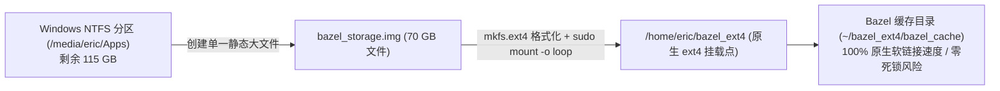

# Intrinsic 工业机器人工程踩坑实录与高频疑难排查手册

> **文档版本**: 1.0 (生产实战排坑与运维全景版)  
> **适用工程**: [intrinsic-core](file:///home/eric/Documents/Code/robot/intrinsic-core) & [intrinsic-omts](file:///home/eric/Documents/Code/robot/intrinsic-omts)  
> **适用环境**: Linux x86_64 (Ubuntu 24.04 LTS / 26.04 LTS)

---

## 目录
1. [存储架构与磁盘高危避坑专题](#1-存储架构与磁盘高危避坑专题)
   - [踩坑 1: 在 Windows NTFS 盘上编译导致 Linux 内核死锁与主机异常重启](#踩坑-1-在-windows-ntfs-盘上编译导致-linux-内核死锁与主机异常重启)
   - [踩坑 2: 根分区空间不足与“方案 B”70GB 原生 ext4 虚拟磁盘 (Loop Mount) 终极实践](#踩坑-2-根分区空间不足与方案-b70gb-原生-ext4-虚拟磁盘-loop-mount-终极实践)
   - [踩坑 3: NTFS 分区异常中断后的“Dirty Bit”修复（无法访问位置）](#踩坑-3-ntfs-分区异常中断后的dirty-bit修复无法访问位置)
2. [权限控制与容器运行时避坑专题](#2-权限控制与容器运行时避坑专题)
   - [踩坑 4: containerd.sock 套接字权限拒绝 (Permission Denied)](#踩坑-4-containerdsock-套接字权限拒绝-permission-denied)
   - [踩坑 5: 微服务并发启动时序导致的 world Pod 暂时性 Error (Transient Failure)](#踩坑-5-微服务并发启动时序导致的-world-pod-暂时性-error-transient-failure)
3. [网络构建与外部依赖避坑专题](#3-网络构建与外部依赖避坑专题)
   - [踩坑 6: GitHub 动态归档哈希漂移导致 tinygltf 校验和不匹配](#踩坑-6-github-动态归档哈希漂移导致-tinygltf-校验和不匹配)
   - [踩坑 7: Google BCR 注册表 TLS 握手瞬时中断 (Remote host terminated handshake)](#踩坑-7-google-bcr-注册表-tls-握手瞬时中断-remote-host-terminated-handshake)
   - [踩坑 8: Git LFS 3D 模型资产仅为文本指针导致仿真崩溃](#踩坑-8-git-lfs-3d-模型资产仅为文本指针导致仿真崩溃)
4. [端到端标准上线时序与运行闭环指南](#4-端到端标准上线时序与运行闭环指南)
   - [阶段 1: 终端 1 启动工作站后台 (omts_solution)](#阶段-1-终端-1-启动工作站后台-omts_solution)
   - [阶段 2: 终端 2 场景同步与姿态估计器注册 (初始化必备)](#阶段-2-终端-2-场景同步与姿态估计器注册-初始化必备)
   - [阶段 3: 终端 2 启动主行为树自动化业务 (omts_app)](#阶段-3-终端-2-启动主行为树自动化业务-omts_app)
   - [阶段 4: 日常研发常用高频命令速查表](#阶段-4-日常研发常用高频命令速查表)

---

## 1. 存储架构与磁盘高危避坑专题

### 踩坑 1: 在 Windows NTFS 盘上编译导致 Linux 内核死锁与主机异常重启

#### 1. 故障现象
在使用 Bazel 编译大型 C++ 机器人依赖（如 Gazebo 仿真、LLVM 工具链）时，若将 `startup --output_user_root` 设在挂载的 Windows NTFS 分区（如 `/media/eric/Apps`），系统会**突然黑屏硬重启**，无任何崩溃弹窗。重启后该 NTFS 分区无法挂载。

#### 2. 根因剖析
* **POSIX 符号链接高并发冲击**：Bazel 构建期间会在毫秒级并发创建数万个 Linux 软链接（symlinks）、硬链接及原子文件重命名。
* **内核驱动死锁**：Linux 5.15+ 内核自带的 `ntfs3` 驱动在处理高并发、多线程的符号链接事务时，容易在内核态发生死锁（Deadlock）。硬件看门狗（Watchdog）判定内核无响应后，直接触发硬件强制重启。

#### 3. 避坑铁律
> [!CAUTION]
> **绝对禁止将 Bazel 的构建输出根目录 (`output_user_root`)、临时目录 (`TMPDIR`) 直接指向 Linux 下挂载的 NTFS 文件系统！** Bazel 必须运行在原生的 POSIX 文件系统（ext4, btrfs, xfs）上。

---

### 踩坑 2: 根分区空间不足与“方案 B”70GB 原生 ext4 虚拟磁盘 (Loop Mount) 终极实践

#### 1. 问题背景
在多系统机器上，Ubuntu 的系统根分区（`/`）往往只分配了 50~60GB，剩余可用空间常不足 30GB。而全量构建 Intrinsic 方案、仿真器与模型缓存通常需要 30~50GB，直接在根目录构建会引发 `no space left on device`。

#### 2. 治理方案 B：Loop Mount 单文件虚拟磁盘技术
如果不想重分区，利用大容量 NTFS 盘创建“单文件虚拟磁盘”，在保持 NTFS 宿主不变的前提下，向 Linux 引入原生 ext4：



#### 3. 实施步骤（全套脚本）

**第一步：创建并格式化 70GB 虚拟镜像（已落地）**
```bash
# 在大容量盘中分配 70GB 空间，并格式化为 ext4
truncate -s 70G /media/eric/Apps/bazel_storage.img
mkfs.ext4 -F -L BAZEL_EXT4 /media/eric/Apps/bazel_storage.img
```

**第二步：一键挂载脚本 (`/home/eric/mount_bazel_ext4.sh`)**
```bash
#!/bin/bash
set -e

MOUNT_POINT="/home/eric/bazel_ext4"
IMG_PATH="/media/eric/Apps/bazel_storage.img"

# 1. 确保底层 Apps 盘已挂载
if [ ! -f "$IMG_PATH" ]; then
    udisksctl mount -b /dev/nvme1n1p2 2>/dev/null || true
fi

mkdir -p "$MOUNT_POINT"

# 2. 挂载 loop 设备
if mountpoint -q "$MOUNT_POINT"; then
    echo "$MOUNT_POINT 已经处于挂载状态！"
else
    sudo mount -o loop "$IMG_PATH" "$MOUNT_POINT"
    sudo chown -R $(id -u):$(id -g) "$MOUNT_POINT"
    echo "挂载成功！"
fi

mkdir -p "$MOUNT_POINT/bazel_cache" "$MOUNT_POINT/tmp"
df -h "$MOUNT_POINT"
```

**第三步：配置工程指向虚拟磁盘 (`intrinsic-omts/.bazelrc.local`)**
```bash
cat << 'EOF' > /home/eric/Documents/Code/robot/intrinsic-omts/.bazelrc.local
# 将构建缓存重定向至 70GB 原生 ext4 虚拟磁盘
startup --output_user_root=/home/eric/bazel_ext4/bazel_cache

# 温和资源限制，保护笔记本散热与系统稳定性
build --local_resources=memory=HOST_RAM*0.5
build --jobs=4
build --action_env=TMPDIR=/home/eric/bazel_ext4/tmp

# 提高下载容错次数
common --experimental_repository_downloader_retries=10
EOF
```

---

### 踩坑 3: NTFS 分区异常中断后的“Dirty Bit”修复（无法访问位置）

#### 1. 故障现象
在系统意外重启或断电后，点击文件管理器中的 NTFS 分区（如 `Apps` 盘），弹出错误弹窗：
> `无法访问位置`  
> `Error mounting /dev/nvme1n1p2 at /media/eric/Apps: wrong fs type, bad option, bad superblock...`

#### 2. 根因剖析
系统内核日志记录：`ntfs3: volume is dirty and "force" flag is not set!`。  
非正常关机导致 NTFS 日志未刷新，Linux 内核驱动检测到脏标记，为防止数据损坏拒绝挂载。

#### 3. 修复方案（1分钟无损恢复）
```bash
# 1. 清除该 NTFS 分区的 dirty 状态标志
sudo ntfsfix -d /dev/nvme1n1p2

# 2. 重新挂载
udisksctl mount -b /dev/nvme1n1p2
```

---

## 2. 权限控制与容器运行时避坑专题

### 踩坑 4: containerd.sock 套接字权限拒绝 (Permission Denied)

#### 1. 故障现象
解压后运行 `./intrinsic-base` 时抛出错误：
> `Error: cannot create containerd publisher: cannot create containerd client at "/run/k3s/containerd/containerd.sock": connect: permission denied`

#### 2. 根因剖析
虽然 `setup_k3s.sh` 脚本执行了 `sudo usermod -aG containerd $USER`，但 Linux 中**已经打开的终端会话不会自动加载新赋予的附加组 ID**，导致权限检查失败。

#### 3. 修复方案
在执行命令的终端中手动刷新当前会话的组身份：
```bash
newgrp containerd
/media/eric/Apps/tmp/intrinsic-base
```
*或者直接以 containerd 组身份单次执行：*
```bash
sg containerd -c "/media/eric/Apps/tmp/intrinsic-base"
```

---

### 踩坑 5: 微服务并发启动时序导致的 world Pod 暂时性 Error (Transient Failure)

#### 1. 故障现象
`intrinsic-base` 部署完成后，查看 `kubectl get pods -n app-intrinsic-base`，发现大部分 Pod 均处于 Running，唯独 `world` Pod 处于 `CrashLoopBackOff` 或 `0/1 Error`。  
查看日志报错：
> `Channel not ready: UNAVAILABLE: gRPC channel to resource-registry... is unavailable. State is GRPC_CHANNEL_TRANSIENT_FAILURE`

#### 2. 根因剖析
k3s 同时下发 17 个微服务，`world` 服务在启动时需要向 `resource-registry` 注册自身。如果 `world` 先于 `resource-registry` 启动完毕，gRPC 连接就会超时（5s）并触发自我崩溃保护。

#### 3. 修复方案
无需恐慌，等待 1~2 分钟使 `resource-registry` 达到 `1/1 Running` 后，删除出错的 Pod 触发其重建：
```bash
kubectl delete pod -n app-intrinsic-base -l app=world
```
重建后的 `world` Pod 将在几秒内恢复至 `1/1 Running`。

---

## 3. 网络构建与外部依赖避坑专题

### 踩坑 6: GitHub 动态归档哈希漂移导致 tinygltf 校验和不匹配

#### 1. 故障现象
执行 `bazel run //:omts_solution ...` 时，构建被阻断并报错：
> `Error in download_and_extract: Checksum was sha256-k+TcDS24... but wanted sha256-uixHoJUTa...`  
> `Error downloading .../syoyo/tinygltf/archive/v2.9.6.tar.gz`

#### 2. 根因剖析
GitHub 官方调整了 Release 归档打包算法，导致动态生成的 `v2.9.6.tar.gz` 真实哈希值发生微小变动。旧版 Bazel Central Registry (BCR) 中锁定的校验和失效。

#### 3. 修复方案
在 [`intrinsic-omts/MODULE.bazel`](file:///home/eric/Documents/Code/robot/intrinsic-omts/MODULE.bazel) 中追加 BCR 修复版的单版本重定向：
```python
single_version_override(
    module_name = "tinygltf",
    version = "2.9.6.bcr.1",
)
```
*（版本 `2.9.6.bcr.1` 中的元数据已自动适配了 GitHub 新生成的 `sha256-k+TcDS24...` 哈希，阻断彻底清除）*

---

### 踩坑 7: Google BCR 注册表 TLS 握手瞬时中断 (Remote host terminated handshake)

#### 1. 故障现象
拉取依赖时偶尔报错：
> `Error accessing registry https://bcr.bazel.build/: Failed to fetch registry file .../grpc/1.74.1/MODULE.bazel: Remote host terminated the handshake`

#### 2. 根因剖析
系统在通过代理工具（如 TUN 模式）连接境外 Google BCR 服务器时发生瞬时的 TLS 握手断开（网络抖动）。

#### 3. 修复方案
在 `.bazelrc.local` 中增加重试保护参数，使 Bazel 在遭遇偶发握手重置时自动重试：
```bash
common --experimental_repository_downloader_retries=10
```

---

### 踩坑 8: Git LFS 3D 模型资产仅为文本指针导致仿真崩溃

#### 1. 故障现象
构建或启动 Gazebo 仿真时发生崩溃：
> `Check failed: ::intrinsic::scene_object::MainImpl() is OK (INTERNAL: Failed to load mesh /.../file.glb. Error is No suitable reader found for the file format...)`

#### 2. 根因剖析
初次克隆仓库时未安装 `git-lfs`，导致 `intrinsic-omts/models/**/*.glb` 仅拉取了 130 字节的 Git LFS 哈希文本指针。

#### 3. 修复方案
```bash
cd /home/eric/Documents/Code/robot/intrinsic-omts
git lfs install
git lfs pull

# 验证文件大小是否从 130B 恢复为数百 KB 至数 MB 二进制实体
ls -lh models/omts_enclosure/omts_enclosure.glb
```

---

## 4. 端到端标准上线时序与运行闭环指南

在所有排坑工作完成后，方案的正式运行严格按照**多终端协作时序**推进：

```
+-----------------------------------------------------------------------------------------+
| 终端 1 (后台宿主): 编译并部署工作站 Solution                                              |
| $ cd /home/eric/Documents/Code/robot/intrinsic-omts                                     |
| $ bazel run //:omts_solution -c opt --//:setup=lab_bb_01 -- \                           |
|     --address=localhost:17080 --operation_mode=sim                                      |
+-----------------------------------------------------------------------------------------+
                                             |
                                             v [等待输出: Timing: XX.XX seconds to wait for ready]
                                             | [注意: 保持终端 1 持续挂起，严禁按 Ctrl+C 关闭]
                                             v
+-----------------------------------------------------------------------------------------+
| 终端 2 (初始化步骤 1): 同步数字孪生到物理仿真世界                                          |
| $ bazel run //tools/world:apply_scene_updates -- --address=localhost:17080 --reset_sim  |
+-----------------------------------------------------------------------------------------+
                                             |
                                             v
+-----------------------------------------------------------------------------------------+
| 终端 2 (初始化步骤 2): 注册毛坯零件 6-DoF 视觉估计器                                      |
| $ bazel run //tools/pose_estimation:register_using_train_service -- \                    |
|     --address="localhost:17080" \                                                       |
|     --scene_object_id="ai.intrinsic.raw_stock_2x3x5" \                                   |
|     --pose_estimator_id="ai.intrinsic.raw_stock_2x3x5_estimator"                       |
+-----------------------------------------------------------------------------------------+
                                             |
                                             v
+-----------------------------------------------------------------------------------------+
| 终端 2 (业务执行): 启动 Python 行为树应用 (全自动机加上下料)                              |
| $ bazel run //src:omts_app -- \                                                         |
|     --address=localhost:17080 \                                                         |
|     --config="configs/lab_bb_01/app_config.yaml" \                                      |
|     --num_cycles=1                                                                      |
+-----------------------------------------------------------------------------------------+
```

---

### 阶段 4: 日常研发常用高频命令速查表

| 操作需求 | 执行命令 (在 `intrinsic-omts` 根目录下执行) |
| :--- | :--- |
| **挂载 70GB 虚拟磁盘** | `/home/eric/mount_bazel_ext4.sh` |
| **离线单元测试预检** | `bazel test //tests/...` |
| **查看世界树坐标系与关节** | `bazel run //tools/world:inspect_world -- --address=localhost:17080` |
| **手动点动微调机械臂 (Jogging)** | `bazel run //tools/jogging:jog_interactive -- --instance=icon --host=localhost --port=17080` |
| **将机械臂移至特定 Frame** | `bazel run //tools/jogging:move_to_frame -- --address=localhost:17080 --frame=view --motion_type=ANY` |
| **现场示教存点至场景配置文件** | `bazel run //tools/jogging:store_frame -- view --address=localhost:17080` |
| **夹爪开合单独测试** | `bazel run //tools/gripper:control_gripper -- --address=localhost:17080 --action=open` |
| **代码格式化与规范检查** | `./tools/format.sh && ./tools/lint.sh` |
