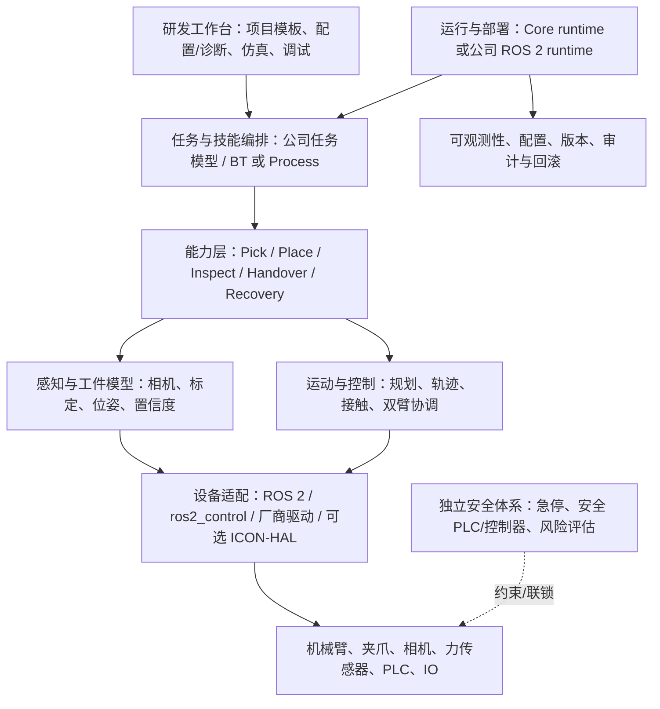

# Intrinsic Core 作为机器人公司共用开发平台的技术评估与实施方案

## 建议结论

对同时发展工业单臂抓放和自研双臂协同作业的公司，建议采用**“ROS 2 为产品主干，Intrinsic Core 做有边界的单臂试点与候选能力底座”**，而不是立即让 Core 成为所有机器人项目的唯一运行时。原因不是 Core 没有价值，而是公开资料能直接核验到 Core 本地 runtime、SDK、运动规划/感知接口、ICON/HAL 和 OMTS 单臂参考流程，却没有核验到 Core 或 OMTS 已提供双臂同步轨迹、跨臂闭链/相对位姿约束或可复用的触觉闭环实现。目标双臂能力应先在公司拥有的 ROS 2/控制主线上定义并验收，再判断是否可由指定 Core 版本和驱动承担。

这条路线仍可积极复用 Core：先复现 Core+OMTS 的仿真工作流，评估 Core 的资产/技能封装、感知与规划服务，再以目标工业单臂进行设备级适配试点。双臂则在隔离验证分支中检验接口、时序、联合约束与失效行为，不将单臂示例或 HAL 抽象当作产品能力证明。项目阶段门、指标类别与停止条件见后文。

本文使用四种标签区分证据：**【官方主张】**表示 Intrinsic 官方产品页、公告或仓库说明对能力的描述；**【源码/文档可见事实】**表示公开仓库、API 定义、配置或教程中能直接检查的内容；**【工程建议】**表示面向本公司平台的架构决策；**【待验证项】**表示本次检查的公开材料不足以确认，需对选定版本和硬件做验证。所有“未找到”均限定于所检查的公开资料，不等于证明能力绝不存在。

## Core 的定位与产品边界

**【官方主张】** Intrinsic 将 Intrinsic Core 描述为其机器人平台中开放出来的一组本地运行时、开发 SDK/API、ROS 互操作能力、硬件抽象、规划、感知/推理和仿真能力。官方发布公告同时把 Flowstate 与企业云服务列为 Core 可协作的其他产品层，故不能把 Core 等同于完整 Intrinsic 平台、Flowstate 或 IntrinsicOS。[Intrinsic Core 产品页](https://www.intrinsic.ai/intrinsic-core)；[开源发布公告](https://www.intrinsic.ai/blog/posts/introducing-intrinsic-core)

**【源码/文档可见事实】** Core 的公开代码仓库是 [intrinsic-ai/intrinsic-core](https://github.com/intrinsic-ai/intrinsic-core)，其 README 把 Core 描述为可以本地部署的执行环境和机器人能力框架。官方 Getting Started 的路径是：在主机上配置 k3s，部署 Core release，安装 `inctl`，然后构建和部署 OMTS 示例。它证明了一个本地开发/仿真路径，不足以单独证明任意真实机器人已适配或达到生产要求。[Core README](https://github.com/intrinsic-ai/intrinsic-core/blob/main/README.md)；[Getting Started](https://github.com/intrinsic-ai/intrinsic-core/blob/main/developer_resources/learn/tutorials/getting_started.md)

**【源码/文档可见事实】** 主仓库标示 Apache-2.0；仓库也声明项目并非 Google 官方支持产品。该许可不能自动延伸至仓库引用的每个模型、驱动包、第三方依赖、商标或商业服务。商业部署前应逐项审阅对应组件的许可与 NOTICE，而不是只看顶层仓库许可证。[LICENSE](https://github.com/intrinsic-ai/intrinsic-core/blob/main/LICENSE)；[README](https://github.com/intrinsic-ai/intrinsic-core/blob/main/README.md)；[商标说明](https://github.com/intrinsic-ai/intrinsic-core/blob/main/TRADEMARK.md)

**【待验证项】** Core README 与 Getting Started 对 Ubuntu 版本的表述不一致：README 列出 Ubuntu 24.04/26.04，并括注 22.04 支持；Getting Started 则要求 Ubuntu 26.04。仓库 README 还列出 ROS 2 Lyrical Luth，但快速开始的实际验证路径以 26.04 为准。项目应把确切 release、OS、ROS 发行版、RMW 和设备驱动锁成一份基线；不能将不同页面拼成未经验证的兼容矩阵。[README 前置条件](https://github.com/intrinsic-ai/intrinsic-core/blob/main/README.md)；[Getting Started 前置条件](https://github.com/intrinsic-ai/intrinsic-core/blob/main/developer_resources/learn/tutorials/getting_started.md)

## 仓库结构与代码入口

Core 不是单语言、单二进制的应用仓库。公开结构按平台模块划分，根级以 Bazel/Bzlmod 管理构建；可见 C++、Python、Go、Protocol Buffers、Bazel 配置和 Notebook 等代码/资产类型。仓库 `.bazelversion` 锁定 Bazel 8.8.1，Python 配置要求 3.11；Go 模块文件声明 Go 1.27.1。以上是当前公开分支的文件状态，实际评估须固定 release tag/commit，而不是依赖可变的 `main`。[仓库根目录](https://github.com/intrinsic-ai/intrinsic-core)；[Bazel 版本](https://github.com/intrinsic-ai/intrinsic-core/blob/main/.bazelversion)；[Bzlmod 配置](https://github.com/intrinsic-ai/intrinsic-core/blob/main/MODULE.bazel)；[Python 依赖](https://github.com/intrinsic-ai/intrinsic-core/blob/main/requirements.in)；[Go 模块](https://github.com/intrinsic-ai/intrinsic-core/blob/main/go.mod)

| 代码入口 | 可见职责与架构含义 | 评审时要分开的事实 |
|---|---|---|
| [`intrinsic_runtime/`](https://github.com/intrinsic-ai/intrinsic-core/tree/main/intrinsic_runtime) | 本地 runtime、k3s 安装/配置、应用及服务部署与生命周期。教程用 `setup_k3s.sh` 和 Core release 建立运行环境。 | **【源码/文档可见事实】** 本地执行和部署路径可见；不等于公司级 OTA、生产监控、SLA 或安全认证已经包含。 |
| [`intrinsic_control/`](https://github.com/intrinsic-ai/intrinsic-core/tree/main/intrinsic_control) 与 [`intrinsic_apis/intrinsic/icon/`](https://github.com/intrinsic-ai/intrinsic-core/tree/main/intrinsic_apis/intrinsic/icon) | ICON 控制栈、动作/状态接口及硬件模块/HAL 配置。 | **【官方主张】** 实时、确定性控制是官方能力描述；**【待验证项】** 指定设备的周期、端到端时延、抖动和故障响应必须实测。 |
| [`intrinsic_hardware/`](https://github.com/intrinsic-ai/intrinsic-core/tree/main/intrinsic_hardware) | 可见硬件相关组件类别，如力/扭矩、GPIO、夹爪、Modbus TCP、OPC UA，以及服务/适配实现入口。 | 抽象配置或某个服务存在，不代表公司目标机型有可直接用的驱动、校准配置或所有控制模式。 |
| [`intrinsic_motion_planning/`](https://github.com/intrinsic-ai/intrinsic-core/tree/main/intrinsic_motion_planning) 与 [intrinsic-moveit](https://github.com/intrinsic-ai/intrinsic-moveit) | Core 运动规划模块；独立 MoveIt 仓库暴露规划服务及 Core 客户端技能。MoveIt 文档提供场景同步、规划服务、TF/关节状态连接入口。 | **【源码/文档可见事实】** 规划和单臂 MoveIt 示例可查；不等于双臂联合约束、目标机器人碰撞模型或时限有保证。 |
| [`intrinsic_perception/`](https://github.com/intrinsic-ai/intrinsic-core/tree/main/intrinsic_perception) | 相机、标定、感知服务/技能等目录。OMTS 示例把 FoundationPose 相关估计器用于物件位姿。 | 模块入口/参考应用可见；特定相机、物件、照明、模型和 GPU 的精度/鲁棒性仍需目标场景验收。 |
| [intrinsic-inference](https://github.com/intrinsic-ai/intrinsic-inference) | 模型资产与推理生命周期管理；ROS 2 节点将模型服务包装为 ROS 服务。可见 Triton 控制器及模型状态接口。 | 通用推理运行框架不等于已交付某个特定机器人视觉/触觉模型。ROS 节点对 RMW 有要求。 |
| [`intrinsic_kinematics/`](https://github.com/intrinsic-ai/intrinsic-core/tree/main/intrinsic_kinematics) | 运动学相关模块入口，供规划/控制能力使用。 | 目录存在不说明目标机器人 URDF、标定、负载和运动学限制已经验证。 |
| [`intrinsic_sdk/`](https://github.com/intrinsic-ai/intrinsic-core/tree/main/intrinsic_sdk) | SDK 与 Python Solution/Behavior Tree 开发入口。可定位 `intrinsic/solutions/deployments.py`、`behavior_tree.py` 等文件。 | SDK API 要跟选定 Core release 一起固定；当前文件路径不代表兼容保证。 |
| [`intrinsic_apis/`](https://github.com/intrinsic-ai/intrinsic-core/tree/main/intrinsic_apis) | Proto/API 定义，按 assets、executive、geometry、hardware、world 等组织；ICON gRPC service 也在此处。 | 接口 schema 是可见契约，不表示后端一定为目标设备实现了对应功能。 |
| [`developer_resources/`](https://github.com/intrinsic-ai/intrinsic-core/tree/main/developer_resources) | 教程、术语表、示例和开发指导。 | 教程覆盖的路径和设备有限；应读对应 release 的说明。 |
| [`third_party/`](https://github.com/intrinsic-ai/intrinsic-core/tree/main/third_party)、[`MODULE.bazel`](https://github.com/intrinsic-ai/intrinsic-core/blob/main/MODULE.bazel) | Bazel 外部规则、依赖和 ROS 相关构建配置。 | 需锁依赖、license、构建镜像和工具链，避免不同项目各自漂移。 |

**【源码/文档可见事实】** SDK 的一个连接入口是 Python `deployments.connect(address="localhost:17080")`；之后可通过 Solution executive 执行技能或 process。API 层则同时有 Python/C++/Go 等客户端路径与 protobuf 服务定义。ICON 的 `service.proto` 可看到 `OpenSession` 双向流、动作签名发现、状态/配置读取、流式写入与输出读取、reaction 监视，以及 `Enable`、`Disable`、`ClearFaults` 等运维调用。该文件本身建议一般调用者使用客户端库，而不是直接构造底层 gRPC 请求。[部署 SDK](https://github.com/intrinsic-ai/intrinsic-core/blob/main/intrinsic_sdk/intrinsic/solutions/deployments.py)；[行为树 SDK](https://github.com/intrinsic-ai/intrinsic-core/blob/main/intrinsic_sdk/intrinsic/solutions/behavior_tree.py)；[ICON service.proto](https://github.com/intrinsic-ai/intrinsic-core/blob/main/intrinsic_apis/intrinsic/icon/proto/v1/service.proto)

**【工程建议】** 公司平台评审不宜按仓库目录照搬，而应把 Core 能力映射到公司拥有的稳定接口：应用/运行生命周期、设备能力描述、运动与控制命令、感知输出、技能输入输出、错误/恢复语义。把 Core-specific API 封装在适配层，领域任务不能直接依赖某个 Python SDK 类型、ICON 的内部 proto 或商业 Flowstate API。

## Skill、Asset、Process 与 Solution 的关系

**【源码/文档可见事实】** 官方术语表把 API 解释为组件之间的明确接口；SDK 包含 API、命令行和构建工具，SBL（Solution Building Library）用于程序化创建 solution/process。Skill 是一种 Asset，封装特定自动化行为并可作为 process 构件；Asset 还可以是 service、hardware device、scene object、process 或 data。Process 可实现为行为树；Solution 把 assets、实例与场景配置组合起来，成为部署单元。仓库中 `intrinsic_solution` Bazel target 可声明资产和实例。[通用术语表](https://github.com/intrinsic-ai/intrinsic-core/blob/main/developer_resources/learn/glossary/general_terms.md)；[Intrinsic 术语表](https://github.com/intrinsic-ai/intrinsic-core/blob/main/developer_resources/learn/glossary/intrinsic_terms.md)；[OMTS BUILD](https://github.com/intrinsic-ai/intrinsic-omts/blob/main/BUILD)

可把其开发链理解为：SDK/SBL 编写资产和流程；Skill 实现一个可编排能力；Behavior Tree/Process 组合技能、异常分支和恢复；Solution 绑定该项目需要的硬件资产、服务和场景，再被构建、部署到 Core runtime。**【工程建议】** 公司应拥有跨产品线的技能语义和质量契约，Core 只作为一种可能的执行/打包后端。比如“抓取工件”不应只定义为调用某个 Core skill 名称，还要规定物体/坐标输入、工具和工件条件、成功判据、超时/取消、失败结果、恢复边界与安全前置条件。

## Core runtime、ICON 与 HAL 的责任边界

**【官方主张】** Intrinsic 将 Core runtime 描述为运行在本地 k3s/Kubernetes 容器环境中的执行层，负责进程生命周期、事件调度和应用状态；将 ICON 描述为实时运动与硬件协调引擎，并称其可根据传感器反馈在控制循环内切换控制器。[Core README](https://github.com/intrinsic-ai/intrinsic-core/blob/main/README.md)；[Intrinsic 架构页](https://www.intrinsic.ai/architecture)；[产品发布公告](https://www.intrinsic.ai/blog/posts/introducing-intrinsic-core)

**【源码/文档可见事实】** ICON 应用层接口可查询可用动作、状态和配置，并建立控制 session。API 模型可以把一个或多个设备 `part` 与 action slot 对应起来；是否兼容取决于真实服务部署的配置和该硬件模块实现了哪些接口。HAL 的 protobuf 把 `module_name/interface_name` 映射到 joint position、velocity、torque、acceleration、wrench、hand-guiding、payload 等 feature。这个 schema 说明 Core 怎样描述硬件接口，不能证明目标机器人驱动实现了每种 command/state，更不能证明对应模式适用于任意负载或达到实时指标。[HAL 通用配置](https://github.com/intrinsic-ai/intrinsic-core/blob/main/intrinsic_apis/intrinsic/icon/control/parts/hal/v1/hal_part_config.proto)；[HAL arm 配置](https://github.com/intrinsic-ai/intrinsic-core/blob/main/intrinsic_apis/intrinsic/icon/control/parts/hal/arm_part/hal_arm_part_config.proto)；[HardwareModuleConfig](https://github.com/intrinsic-ai/intrinsic-core/blob/main/intrinsic_apis/intrinsic/icon/hal/proto/hardware_module_config.proto)

一个需要单独阅读的适配样例是 [icon-hwm-controller](https://github.com/intrinsic-ai/icon-hwm-controller)：它展示 ros2_control hardware component 与 ICON hardware module 的桥接。其 README 明确描述当前位置控制机械臂的桥接，并列举 UR 与 FANUC 样例；该 bridge 当前不支持数字或模拟 I/O。这项限制只描述该仓库，不是对整个 ICON/HAL 的总括；反过来，HAL 能列出更多接口也不能证明这个 bridge 或其它具体驱动已实现它们。

**【安全边界】** Core 的 safety status API 能报告安全模式、急停/使能状态及请求状态，ICON 有 Disable/ClearFaults 等接口；但 service 注释要求真实硬件部署前完成风险评估并设置足够安全系统。**【待验证项】** 在检查的公开资料中没有找到 Core 被证明为认证安全控制器或 safety PLC 替代物的材料。急停链、安全门、区域扫描、速度/力限制、功能安全控制与风险评估必须由公司和设备安全责任人独立设计、评审与验证。[SafetyStatus proto](https://github.com/intrinsic-ai/intrinsic-core/blob/main/intrinsic_apis/intrinsic/icon/proto/safety_status.proto)；[ICON service 安全注释](https://github.com/intrinsic-ai/intrinsic-core/blob/main/intrinsic_apis/intrinsic/icon/proto/v1/service.proto)

## 规划、感知、推理、仿真与 ROS 互操作

**规划。** **【官方主张】** Core 将规划定位为碰撞规避路径生成、笛卡尔任务与配置空间运动、运动学/工作空间限制及多段轨迹处理。**【源码/文档可见事实】** 仓库存在 `intrinsic_motion_planning` 模块；独立 [intrinsic-moveit](https://github.com/intrinsic-ai/intrinsic-moveit) 仓库公开 MoveIt 2/MTC 规划服务和 Core 客户端技能，服务入口包括 `motion_planning/get_motion_plan` 与 `grasp_planning/plan_grasps`。其示例使用 UR5e/单规划组并要求同步规划场景、TF 和 joint states。其 grasp endpoint 文档描述的是基于 MTC 的盒状工件候选抓取生成器，不应写成通用抓取能力的证明。[Core README](https://github.com/intrinsic-ai/intrinsic-core/blob/main/README.md)；[MoveIt planning service](https://github.com/intrinsic-ai/intrinsic-moveit/blob/main/moveit_planning_service/README.md)

**感知与推理。** **【源码/文档可见事实】** Core 感知目录可见相机、标定和服务/技能入口；OMTS 用 FoundationPose 相关组件获得工件位姿。独立 [intrinsic-inference](https://github.com/intrinsic-ai/intrinsic-inference) 提供模型资产/状态管理及 Triton 控制器；ROS inference node 将 Open Inference Protocol 的健康、模型状态、metadata、infer 等端点包装为 ROS 服务。其文档对 RMW 有明确要求。**【待验证项】** 不应把存在的推理服务框架当成特定物件类别、现场光照和目标 GPU 上的识别准确率证明。[Core perception 目录](https://github.com/intrinsic-ai/intrinsic-core/tree/main/intrinsic_perception/intrinsic/perception)；[inference core](https://github.com/intrinsic-ai/intrinsic-inference/blob/main/intrinsic_inference/core/README.md)；[ROS inference node](https://github.com/intrinsic-ai/intrinsic-inference/blob/main/intrinsic_inference/ros/inference_node/README.md)

**仿真。** **【源码/文档可见事实】** Core+OMTS quickstart 以 `operation_mode=sim` 部署，并使用 Gazebo；官方教程还提供 Gazebo GUI、RViz 查看方案。仿真可支持流程开发和可视化，但公开教程没有给出任意目标单元的 sim-to-real 误差界限、碰撞模型准确度或安全认证结论。[Getting Started](https://github.com/intrinsic-ai/intrinsic-core/blob/main/developer_resources/learn/tutorials/getting_started.md)；[可视化 Solution](https://github.com/intrinsic-ai/intrinsic-core/blob/main/developer_resources/learn/tutorials/visualize_the_solution.md)；[可视化机器人](https://github.com/intrinsic-ai/intrinsic-core/blob/main/developer_resources/learn/tutorials/visualize_the_robot.md)

**ROS 互操作。** **【官方主张】** Intrinsic 将 Core 描述为兼容 ROS 2 生态，可使用标准 ROS 工作空间/消息并桥接 Core 与 ROS 项目。**【源码/文档可见事实】** Core 相关官方仓库中有 MoveIt 集成、ROS inference node、ROS 相机驱动以及 ICON/ros2_control bridge；这些是不同的集成路径，不是一项全局、任意发行版互通保证。MoveIt 文档要求显式配置 bridge、TF、控制器实例、joint name 与 joint states；相机和 inference 文档分别涉及 rmw_zenoh 与 rmw_cyclonedds_cpp 环境要求。必须针对目标 ROS 发行版、RMW、消息版本、时钟、TF、规划场景与驱动组合做端到端验证。[Core README](https://github.com/intrinsic-ai/intrinsic-core/blob/main/README.md)；[Flowstate ROS bridge 配置](https://github.com/intrinsic-ai/intrinsic-moveit/blob/main/docs/flowstate_ros_bridge_configuration.md)；[Intrinsic 相机驱动](https://github.com/intrinsic-ai/intrinsic-ros-camera-drivers)

**【工程建议】** 将 ROS bridge 视为传输/数据互通工具，而不是任务语义、安全语义、时钟同步或故障恢复已打通的证据。每个集成配置应显式记录 topic/service、TF 树、joint name、controller、RMW、网络发现、时间戳、单位、超时、故障状态传播和唯一命令所有者；不能让 Core/ICON 与公司 ROS 控制器同时对同一轴发控制命令。

## OMTS：可复现的单臂参考工作流

**【源码/文档可见事实】** [OMTS（Open Machine Tending Solution）](https://github.com/intrinsic-ai/intrinsic-omts) 是基于 Core 的机器上下料参考应用。默认配置用一台 UR5e，另有 `lab_bb_01` 单臂 UR3e 仿真配置；公开 BUILD 注释指出 `kr_10` 配置尚未接入 `omts_solution`。当前可检查的 `main.py` 创建一个 `Robot`，主行为树对这一台机器人顺序运行抓取、装料、等待机床、卸料、返回等子树。因此它是单臂工作单元证据，不是双臂工作流证据。[OMTS BUILD](https://github.com/intrinsic-ai/intrinsic-omts/blob/main/BUILD)；[OMTS 配置目录](https://github.com/intrinsic-ai/intrinsic-omts/tree/main/configs)；[主入口](https://github.com/intrinsic-ai/intrinsic-omts/blob/main/src/main.py)；[主行为树](https://github.com/intrinsic-ai/intrinsic-omts/blob/main/src/behaviors/machine_tending_bt.py)

单周期的参考逻辑为：机器人到观察位；相机取得图像并估计工件位姿，写入预抓取/抓取帧；开夹爪、规划接近、执行接触、闭合夹爪并将工件附着到工具坐标；把原料放入机床夹具；退到安全位置并启动机床；等待加工完成；抓取加工件；将成品放回放置区。有限循环由 `num_cycles` 控制，特定配置可用连续循环。其行为树拆解和抓取源码可直接检查。[OMTS 架构](https://github.com/intrinsic-ai/intrinsic-omts/blob/main/docs/ARCHITECTURE.md)；[抓取子树](https://github.com/intrinsic-ai/intrinsic-omts/blob/main/src/behaviors/pick.py)；[运动行为](https://github.com/intrinsic-ai/intrinsic-omts/blob/main/src/behaviors/motions.py)

**【源码/文档可见事实】** OMTS 的 `build_move_to_contact_task` 把方向、接触力阈值（单位 N）与超时传入 `move_to_contact` skill。默认配置有 10 N 阈值、30 秒超时的接触动作参数。这证明应用层调用了阈值式接触技能；它没有揭示底层传感器型号、扭矩/力采样率、伺服律、限幅、坐标变换或失效安全机制。[Robot adapter](https://github.com/intrinsic-ai/intrinsic-omts/blob/main/src/hardware/robot.py)；[OMTS app config](https://github.com/intrinsic-ai/intrinsic-omts/blob/main/configs/omts/app_config.yaml)

**【双臂边界】** OMTS 中可见多段轨迹/blended motion，但这些 segment 都由同一个 `Robot`/arm part 构造；`RelativePoseEquality` 的可见用法是工具帧相对其当前位姿运动，不是左右臂之间相对姿态或闭链约束。多 waypoint、不等于两臂同步执行；一个工具帧的相对运动、不等于两臂共同抓持刚体。[OMTS robot.py](https://github.com/intrinsic-ai/intrinsic-omts/blob/main/src/hardware/robot.py)；[OMTS motions.py](https://github.com/intrinsic-ai/intrinsic-omts/blob/main/src/behaviors/motions.py)

### 从 Core quickstart 到 OMTS 仿真

以下复述公开教程中的步骤与前置条件，不代表本报告已在目标公司的设备上执行。教程及 Core 发布标签采用 `20260922.0`；应把 Core、OMTS 与 Bazel 依赖固定到相同、明确的版本，而不要追踪默认分支。[Core 20260922.0 release](https://github.com/intrinsic-ai/intrinsic-core/releases/tag/20260922.0)；[OMTS MODULE.bazel](https://github.com/intrinsic-ai/intrinsic-omts/blob/main/MODULE.bazel)

**主机与工具。** Getting Started 要求 Ubuntu 26.04；OMTS README 给出的主机参考为 x86-64、32 GiB RAM 最低/64 GiB 推荐、1 TB NVMe、100 GB 以上可用空间，网络方案参考 2–3 个千兆网口。Core README 与 quickstart 的 Ubuntu 版本说法存在冲突，先在评估记录中固定实际版本。教程称 AMD CPU 可用于仿真，实时机器人硬件控制需要 Intel CPU。Core quickstart 要求 git、git-lfs、GitHub CLI 并执行 GitHub 登录；随后获取 Core/OMTS 指定 release、安装 k3s、下载 Core runtime release 和 `inctl`。这些是教程路径的前置，不是 Intrinsic 云账户已必需的证据。[Core Getting Started](https://github.com/intrinsic-ai/intrinsic-core/blob/main/developer_resources/learn/tutorials/getting_started.md)；[OMTS README](https://github.com/intrinsic-ai/intrinsic-omts/blob/main/README.md)

**构建和部署。** 按教程下载并启动 `intrinsic-base-linux-amd64.tar` 对应的本地 Core runtime，安装 `inctl`；安装 Bazelisk，并按 Ubuntu 26.04 教程配置所需的 libxml2 兼容链接。OMTS 初次构建需要从源码构建 Gazebo 和部分几何依赖，教程给出约 50 分钟作为其环境下的估算，不能当作性能或工期承诺。核心仿真部署命令为：

```bash
bazel run //:omts_solution --config=lab_bb_01 -- \
  --address localhost:17080 --operation_mode=sim
```

**感知和应用运行。** 若启用教程提供的感知包，先依官方 GPU setup 配置 NVIDIA GPU 给 k3s 使用；教程指出完整 OMTS 感知仿真需要独立 GPU，并建议 RTX 3060/4060 或更高等级显卡，但没有在所检查材料中给出最低显存/完整兼容矩阵。教程的仿真步骤还包括注册 FoundationPose estimator，然后以与 solution 一致的 `lab_bb_01` cell 配置启动 OMTS app；可检查的 app alias/参数入口为 `//src:omts_app`、`--address`、`--config` 与 `--num_cycles`。可视化教程还提供 Gazebo GUI 与 RViz 的独立安装/连接步骤；它们不是 Core runtime 本身的必装组件。[GPU setup 与仿真部署](https://github.com/intrinsic-ai/intrinsic-core/blob/main/developer_resources/learn/tutorials/getting_started.md)；[Solution 可视化教程](https://github.com/intrinsic-ai/intrinsic-core/blob/main/developer_resources/learn/tutorials/visualize_the_solution.md)；[机器人可视化教程](https://github.com/intrinsic-ai/intrinsic-core/blob/main/developer_resources/learn/tutorials/visualize_the_robot.md)；[OMTS BUILD targets](https://github.com/intrinsic-ai/intrinsic-omts/blob/main/BUILD)

**重要模式保护。** OMTS BUILD 当前默认 operation mode 是 `real`；仿真必须显式传 `--operation_mode=sim`。教程也提醒部署端和 app 端 cell config 要匹配。忽略此点可能造成 ICON 未运行或仿真器无动作。Core 基础 runtime、OMTS solution 仿真部署与 OMTS app 执行是三个不同验收点，不能把 `bazel run ...omts_solution` 成功当作抓放 task 已成功。[OMTS BUILD](https://github.com/intrinsic-ai/intrinsic-omts/blob/main/BUILD)；[Core Getting Started](https://github.com/intrinsic-ai/intrinsic-core/blob/main/developer_resources/learn/tutorials/getting_started.md)

## 双臂、同步、闭链与力觉能力：公开证据审计

**【源码/文档可见事实】** 已检查 OMTS 的 app 配置、Python 主入口、行为树、运动技能与教程，公开参考是单个机械臂。ICON 的 API/HAL 能表达多个 parts/slots，也有 joint torque、wrench 等接口字段；这是通用接口和配置形态，不是可运行双臂控制实例或目标机器人支持表。[ICON service.proto](https://github.com/intrinsic-ai/intrinsic-core/blob/main/intrinsic_apis/intrinsic/icon/proto/v1/service.proto)；[HAL arm proto](https://github.com/intrinsic-ai/intrinsic-core/blob/main/intrinsic_apis/intrinsic/icon/control/parts/hal/arm_part/hal_arm_part_config.proto)

| 待核验能力 | 公开资料中可见什么 | 可作出的判断 |
|---|---|---|
| 双臂协同抓放 | OMTS 的配置、Robot adapter 与任务行为均按一台 arm 实现。Core/HAL 的通用 part 模型可表示设备部件。 | **【待验证项】** 在已检查的公开 Core/OMTS 资料中未找到双臂协同抓放代码/示例；不能从多 part schema 推导双臂任务支持。 |
| 同步轨迹/对时 | OMTS 有同一机器人多段及 blended trajectory。ICON 有流式动作接口。 | **【待验证项】** 未找到跨两臂共享时间基准、同步屏障、同步误差指标或联合轨迹的可运行接口。单臂多段轨迹不是多臂同步轨迹。 |
| 臂间相对位姿/闭链 | OMTS `RelativePoseEquality` 用于单个末端工具帧相对当前姿态移动；MoveIt 示例使用单规划组。 | **【待验证项】** 未找到左右臂相对变换、闭链刚体约束、共同抓持物体的公开实现。单末端相对运动不是臂间闭链约束。 |
| 力/扭矩反馈 | OMTS 把阈值传给 `move_to_contact`；HAL arm schema 列 torque/wrench 等字段。某 ICON bridge 仓库明确限于位置控制且不支持模拟/数字 I/O。 | **【源码/文档可见事实】** 有接触技能调用与控制接口字段；**【待验证项】** 未找到公开 OMTS 源码展示底层六维力/扭矩闭环、采样/滤波/时延或目标设备驱动验证。 |
| 触觉反馈 | Intrinsic 官方挑战报道提及实机高频力/扭矩反馈，以及仿真对 tactile snap 机制的局限。 | **【官方主张】** 可证明官方报道真实机器人任务用到此类反馈；**【待验证项】** 未找到 Core/OMTS 开源仓库中的触觉传感器驱动与可复用触觉闭环实现。 |
| 多机器人研究 | RoboBallet 官方博客称研究方案可规划最多八台机器人。 | **【官方主张】** 这是研究报道；在所查资料中没有找到其与 Core/OMTS API、代码或 quickstart 的集成，不能作为产品能力证据。 |

相关来源：[Intrinsic Core 产品页](https://www.intrinsic.ai/intrinsic-core)；[OMTS 主仓库](https://github.com/intrinsic-ai/intrinsic-omts)；[Intrinsic Core ICON HAL](https://github.com/intrinsic-ai/intrinsic-core/tree/main/intrinsic_control/intrinsic/icon/hal)；[ICON hardware controller](https://github.com/intrinsic-ai/icon-hwm-controller)；[RoboBallet 研究公告](https://www.intrinsic.ai/blog/posts/specialized-ai-for-scalable-and-adaptive-multi-robot-orchestration)；[AI for Industry Challenge 报道](https://www.intrinsic.ai/blog/posts/ai-for-industry-challenge)

**结论。** 不能据公开资料把 Core 写成“已支持双臂协同抓放、同步轨迹、闭链控制或触觉控制产品”。应写成：Intrinsic 对传感器控制、实时控制和多机器人研究有官方描述；Core/HAL 有可配置的硬件抽象接口；OMTS 展示单臂抓放与阈值式接触调用；而目标双臂需要的跨臂同步、相对约束、联合规划、力/扭矩/触觉闭环在本次检查的公开可运行实现中未获证实。该判断不是断言未公开产品/未来版本绝无此能力。

## 面向多项目的公司平台参考架构

平台目标不是把每个项目强行统一成同一种机械臂，而是统一**接口、数据语义、技能契约、交付流程和验证证据**，同时允许单臂、双臂及不同控制器以可替换实现接入。以下是公司应拥有的参考架构；Core 可被映射到其中部分层，不应被视作自动覆盖整栈。



图中公司编排可使用 Core Behavior Tree/Solution 或自有 ROS 2/工作流层。无论选哪个，都必须保留独立安全责任边界。

| 层次 | 可优先复用的 Core 能力（证据边界） | 公司必须拥有的契约与责任 |
|---|---|---|
| 主机与基础运行 | Core 的本地 k3s runtime、inctl、release 部署路径；Core+OMTS 仿真教程。 | 目标 OS/驱动基线、镜像/依赖锁定、离线部署/升级回滚、现场网络与存储策略、生产运行责任。 |
| 设备抽象/控制接口 | ICON/HAL schema、特定已验证硬件模块；有条件地复用 ros2_control-to-ICON bridge。 | 具体臂、夹爪、相机、传感器/PLC 的适配器与能力矩阵；坐标/单位/时间语义；一个设备唯一控制者；固件和校准版本。 |
| 规划与运动 | Core motion planning/ICON 或 intrinsic-moveit 作为候选规划服务。 | 目标机器人模型、碰撞/禁区、规划超时/恢复策略；双臂联合可达性、相对约束、同步及负载条件必须自行定义和验收。 |
| 感知/推理 | Core perception/inference 模块、OMTS FoundationPose 路径、Triton/ROS 服务集成。 | 标定和数据集、模型版本与适用范围、置信度/拒识阈值、漂移监控、推理失败时安全行为。 |
| 技能与领域模型 | 可把 Core Skill/Asset/Process/Solution 当一种封装/执行实现。 | 公司定义 Cell、Robot、Arm、Tool、Object、Fixture、Workpiece、Task、SafetyState 等领域模型；定义技能输入/输出、前置条件、成功判据、取消、超时、幂等性、错误码与恢复语义。 |
| 应用编排 | Core SBL、Behavior Tree、Executive 可用于 Core 项目；ROS 2 行为树/自有流程也可做替代。 | 跨项目任务语义与版本契约；项目定制流程不应渗入共享底座；明确哪个栈负责实时命令、哪个栈只做任务编排。 |
| 开发者体验/UI | Core 教程提供本地部署、Solution/Asset 方式；Flowstate 是商业图形工作台候选。 | 公司工作台、项目脚手架、配置校验、设备诊断、权限、日志查看和调试流程；不得让日常开发依赖未确认的商业服务准入。 |
| CI/CD 与版本 | Core/Bazel 构建和资产 bundle 可用作候选构建机制。 | 固定 Core/OMTS/SDK/驱动/固件/模型/ROS/RMW 兼容清单；自动构建、仿真回归、硬件矩阵、SBOM/许可证扫描、签名发布、可回滚制品库。 |
| 运维与安全 | ICON 状态/故障 API 可以成为运行状态来源之一。 | 独立安全系统、风险评估、审计、告警、运行指标、远程维护、权限、异常停机规则和事故追溯。ICON API 不替代安全认证。 |

### 可复用、可替换机制

1. **公开的公司域接口，封装 Core/ROS 类型。** 设备能力通过显式 capability contract 声明，例如 joint-position、cartesian-motion、gripper、force-sensing、digital-IO；域层消费者先协商所需能力，不依靠“所有机器人相同”的隐含假设。Core 的 part/slot/HAL 可以做一类实现，ROS 2 action/service/topic 也可以做另一类实现。
2. **为每个项目提供硬件 profile。** 每个 profile 固定机器人/末端工具/相机/PLC 型号、固件、URDF/运动学模型、关节名、TF、RMW、控制器、标定版本、限制值与对应 driver image。运行时启动校验发现能力不匹配就拒绝下发任务，而不是在执行时静默降级。
3. **技能有行为契约而不只有 API 名称。** 例如 `Pick(object_pose, object_id, tool_id)` 应规定坐标系、单位、质量/尺寸范围、置信度、允许重试、夹取后成功检测与撤回策略。底层可映射到 Core Skill，也可映射到公司 ROS 2 node，但测试使用相同契约。
4. **每个运动资源单一写入所有者。** 对同一台臂，不允许 Core ICON 与另一套控制器同时拥有 command channel。跨进程的感知、规划和监控可组合，实时执行责任在配置中只有一个明确 owner。
5. **隔离项目差异并钉版本。** 共享组件独立发布语义版本；每个 Solution/ROS workspace 维护 lockfile/manifest，固定 Core release/commit、API/SDK、Bazel、ROS distro/RMW、驱动、固件、模型与校准资产。Core 当前 release 标签是日期式，而不是以此推定存在稳定语义版本或长期兼容承诺。[Core releases](https://github.com/intrinsic-ai/intrinsic-core/releases)
6. **接口兼容性测试先于实现替换。** 对 Core adapter、ROS adapter、sim adapter 跑同一组契约测试：发现能力、状态更新、坐标换算、限位、超时/取消、错误码、重连和安全联锁。替换某个后端时，任务编排层不应需要重写领域逻辑。

### 仿真、影子、HIL 到实机的验证路径

| 阶段 | 做什么 | 必须通过的证据门 |
|---|---|---|
| 0. 可复现环境 | 锁定 Core release/commit、OS、ROS/RMW、Bazel、模型、硬件 profile；运行纯构建和单元测试。 | 干净主机可按记录复现；依赖/许可证/支持责任清晰；无版本漂移。 |
| 1. 合约与模拟适配器 | 用 fake/sim adapter 验证设备接口、技能成功/失败、取消、重试和状态变化。 | 同一任务 API 不依赖 Core/ROS 实现细节；故障注入可预测。 |
| 2. Core+OMTS 仿真 | 先复现官方单臂 `lab_bb_01`，分别验收 runtime、solution 部署、感知 estimator、app 任务；再建立公司工位的仿真模型。 | 记录 model/config、topic/TF、构建和执行日志；仿真通过只代表软件闭环通过。 |
| 3. ROS/ICON 影子接口 | 连接真实设备的只读状态（joint state、IO、传感器、时钟），仿真/规划并行计算但不向真机下发动作；比较估计状态与观测。 | 明确只读权限和物理隔离；检查 TF/时间戳/单位一致性、模型偏差、掉线/数据陈旧告警。 |
| 4. HIL | 将真实控制器、驱动、PLC/IO 或传感器接入测试环境；先不接执行机构，或使用经批准的低能量/隔离测试工装；验证通信、周期、故障注入、急停链。 | 真正验证驱动固件与安全联锁；任何 command path 都有硬件/软件隔离并经安全评审。 |
| 5. 单臂实机 | 以工业单臂抓放作先导；分阶段开放低速、空载、软质/受控工件、正常速度；测量节拍、误差、异常恢复。 | 由团队预先定义量化门槛；验收真实传感器、抓取判据、停机/复位、长期运行和操作流程。 |
| 6. 双臂实验单元 | 用自研目标双臂和最终控制器测试对时、同步启动/停止、共同抓持、相对位姿/闭链约束、联合碰撞、单臂故障传播。 | 逐项证明两臂协调和安全；通过前不进入产品关键路径，也不以 OMTS 单臂结果代替。 |
| 7. 受控生产发布 | 锁定制品与配置，执行现场风险评估、回滚演练、运维交接和发布审批。 | 发布基线可重建；安全责任、监控、补丁策略、恢复和退役方案明确。 |

**影子模式特别注意：** “影子”必须是只读或物理隔离的规划/预测接口，不得只是软件约定的 no-op。应从硬件权限、网络路由或安全 PLC 层阻断意外 command path。**HIL**应逐步引入驱动与真实 I/O；接入真实执行器或运动控制器之前，由负责安全的工程师批准工装、限能方式、急停和安全围栏安排。

## 两条平台路线比较与推荐

| 维度 | Core 为主要运行时底座 | ROS 2 为主干、上层自研并择机接入 Core |
|---|---|---|
| 初始平台覆盖 | **优势：** 可优先试用本地 runtime、资产/技能、规划、感知、推理、仿真和 SDK 的组合；OMTS 提供单臂参考。 | **代价：** 公司需要自己组合运行时、设备、规划、部署、UI 和运维。 |
| 双臂关键路径 | **风险：** 公开资料未证明目标双臂所需的同步、闭链、联合碰撞与故障协调；核心产品依赖先于证据。 | **优势：** 公司可先定义并掌握双臂控制和任务契约；Core 可以在通过能力验证后作为个别服务或技能后端接入。 |
| 设备与生态 | **优势：** ICON/HAL 提供统一抽象，某些桥接已有官方仓库。**风险：** HAL schema 不等于特定型号驱动或多模态/I/O 支持。 | **优势：** 可沿 ROS 2/ros2_control 与既有厂商驱动构建产品主线。**风险：** ROS 的发行版、RMW、网络、控制器与不同包组合需要公司维护兼容矩阵。 |
| 开发/维护责任 | **优势：** Core 提供现成的运行时与应用模型候选。**风险：** 需承担 Core 版本、API、Bazel、硬件桥接与商业平台边界的依赖评估。 | **优势：** 产品级领域模型、技能、设备适配和运维由公司掌握。**风险：** 不能期待 Core 提供的能力自动可用；公司需承担集成和持续维护。 |
| 商业平台依赖 | Core-only 可本地部署的路径有公开教程；Flowstate/IntrinsicOS/云服务是另一个商业层，条件需确认。 | 可在不绑定 Flowstate/IntrinsicOS 的前提下开发；若后续接入商业服务，需把依赖限制在可替换适配器中。 |
| 回退难度 | 如果任务模型、设备契约和部署流程直接绑定 Core/Flowstate，退出代价会高。 | 只在接口边界接入 Core，保留 ROS 主干和公司技能语义，退出时可替换运行时/服务。 |

**建议路线。** 先将 ROS 2 作为产品与设备主干，公司拥有双臂任务语义、同步/相对约束接口、实机安全流程和端到端 CI。把 Core 作为本地仿真/单臂能力的候选运行环境，进行受限试点；再分别验证指定型号的 ICON/HAL 驱动、Core 与 ROS 的目标版本组合、单臂真机表现。仅当 Core 在明确配置下通过双臂阶段门，才考虑把双臂控制责任迁移到 Core。**这不是“默认不选 Core”，而是依据已核验的单臂证据与双臂证据缺口控制架构风险。**

## 试点设计、阶段门与成功指标

**试点 A：复现官方 OMTS。** 目标是掌握 Core runtime、Bazel/资产构建、Solution 部署、仿真模式、感知 estimator 与 app 的分界，并记录环境冲突。它是平台学习/仿真试点，不是公司工艺验收，也不验证双臂。

**试点 B：目标工业单臂抓放。** 把公司真实相机、夹爪、单臂控制器和目标工件接入；对同一技能契约分别做 Core/ICON 与 ROS 主干实现或同等对照。只有拿到可维护的具体驱动、坐标/校准链、控制模式与现场安全方案后才进入真机执行。

**试点 C：双臂概念验证。** 公司先定义最小的双臂任务与可测量验收项，再检查 Core 可否表示并运行该任务。最小任务应覆盖：两臂协调启停；共同搬运物体时的相对位姿或闭链约束；两臂碰撞与可达性；一个控制器/传感器掉线时的安全停机和恢复。只在隔离实验单元测试，不能把 Research blog 或单臂 OMTS 当作通过证据。

**阶段门：**

- **门 0：技术基线锁定。** 指定 Core/OMTS release、操作系统、ROS 发行版/RMW、Bazel、每个设备 profile 与许可证清单；先解决 Ubuntu 要求冲突。基线无法重复，就不进入硬件测试。
- **门 1：仿真可重复。** 从干净环境部署 Core、运行单臂 OMTS，再运行公司任务模型。记录构建、部署、状态、TF、感知和任务事件；不能将仿真状态等同真实控制性能。
- **门 2：目标单臂 HIL/实机。** 验证驱动、标定、接触动作的力传感来源、坐标、采样、限值语义；在场地安全方案下测试正常、超时、抓取失败、传感器丢失、急停与恢复。
- **门 3：双臂实验单元。** 独立验收同步误差、相对位姿/闭链、联合规划/碰撞、单臂故障、停机与重新同步。若 Core 路径任一关键能力未证实，双臂产品仍走公司验证通过的 ROS 2/控制路径。
- **门 4：产品化。** 固定发布产物、更新回滚、监控、许可证、安全责任和现场维护；对未经验证的商业支持/SLA 不作依赖。

**成功指标类别（目标值须由公司在试验前定义，不从公开资料臆造）：**

- **功能正确性：** 抓取/放置/双臂搬运成功判定、位置/姿态误差、工件损伤、误抓/漏抓及异常分类。
- **实时与生产节拍：** 控制周期、端到端延迟与抖动、规划时间、任务周期分布、负载变化下的稳定性。
- **可靠性和恢复：** 连续运行、失败重试、断连/传感器失效/控制器复位恢复、故障安全状态和人工介入率。
- **双臂协调质量：** 两臂同步启动/停止偏差、共同搬运相对位姿误差、闭链载荷/应力、碰撞和可达性边界。
- **感知/接触质量：** 位姿误差与置信度校准，误拒识，接触检测准确性，力/扭矩传感器漂移/噪声以及接触停止响应。
- **安全：** 急停、安全门、区域/速度限制、碰撞保护、故障传播、风险评估项关闭情况；安全通过是硬门槛，不用生产率折抵。
- **可移植性：** 增加新设备所需的接口/模型变化范围、共享技能是否需改、目标 profile 的契约测试通过情况。
- **研发效率和可维护性：** 从干净环境复现构建的成功率、部署回滚、问题定位所需诊断数据、升级兼容与运维负担。
- **依赖与成本：** Core/Flowstate/IntrinsicOS 许可边界、硬件和运行资源、外部支持责任、私有部署/离线要求；不假设商业服务包含在开源 Core 中。

## 止损条件与退出策略

以下任一项触发时，不继续扩大 Core 在关键路径的占比：

1. 无法形成固定、可重复的 Core/OMTS/OS/ROS/RMW 构建与部署基线，或目标依赖不满足许可、隔离网络或更新要求。
2. 目标设备没有可验证、可维护的实际驱动/接口；只有 HAL 配置或宣传材料，但控制模式、I/O、传感器反馈、状态同步不满足需求。
3. 经预先定义的实时、成功率、恢复或运维门槛未通过，或者跨版本/跨设备无法重复；不得通过放宽安全限制来保留路线。
4. 双臂同步、闭链/相对约束、联合碰撞/可达性、力/扭矩/触觉闭环或失效安全中的任一关键验收缺乏证据：Core 不进入双臂产品关键控制路径，双臂任务留在公司验证过的实现上。此决定不是断言 Core 永远不支持这些能力。
5. 真实机器人风险评估、急停、安全回路或功能安全责任无法明确/验收；停止真机生产化。ICON 的安全状态 API 不能代替独立安全系统证据。
6. 团队无法接受 Flowstate/IntrinsicOS/商业云服务的接入条件、维护模式或支持责任时，不依赖这些商业层。公开产品页不能替代合同、SLA、授权或可用性确认。

**退出设计。** 从试点开始就把 Core-specific SDK、proto、asset bundle 和 ICON 会话调用限制在 backend adapter；公司拥有的技能契约、任务定义、设备 profile、标准化单位/坐标/状态模型、仿真测试与发布清单独立保存。若退出 Core，替换部署/技能执行/设备 adapter，并保留 ROS 2 产品主干、任务逻辑、标定、模型和 CI 资产。不要把 Flowstate 私有项目状态作为唯一真源；关键配置、机器人模型、技能声明、发布 manifest 与测量结果应可以导出、审阅和复建。

该方案使 Core 在证据充分的层面发挥价值，同时把未证实的双臂能力保持为显式工程问题。试点的最终判断应基于固定版本、目标设备和公司预先设定的测量门槛，而非产品宣传、仓库目录或单臂示例本身。
