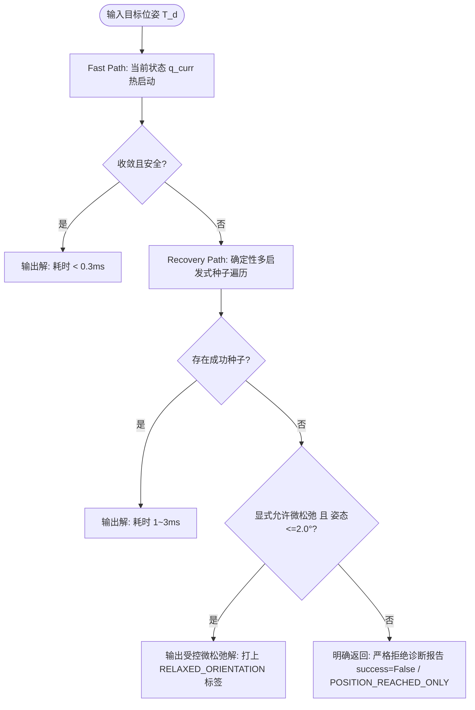

# Humanoid Arm–Waist 冗余全身逆运动学方案设计与技术报告

> **平台目标**：人形机器人（Unitree / G1 平台）上肢 7 DoF 单臂 + 3 DoF 腰部全身协同运动学
> **核心任务**：6D 空间位姿末端跟踪（EE Pose Tracking）、冗余度优化分配与物理有界约束求解
> **设计哲学**：手臂优先、腰部辅助、平滑回零、分层解耦、结果可诊断、异常可退化

---

## 第一章：背景与问题定义 (Problem Formulation)

### 1.1 机器人上肢与腰部冗余自由度系统建模

在人形机器人、协作机械臂及移动双臂操作机器人中，末端执行器（End-Effector, EE）通常需要完成三维位置与三维姿态共 6 个自由度（6D Pose）的精准控制。针对机械系统自身自由度大于任务空间自由度的情形，构成了经典的冗余逆运动学（Redundant Inverse Kinematics, Redundant IK）问题。

以 Unitree / G1 等人形机器人上肢配置为例，单侧机械臂通常具有 7 个自由度（7 DoF）。当进一步将腰部的偏航（Yaw）、横滚（Roll）、俯仰（Pitch）共 3 个自由度纳入末端控制后，机器人广义坐标表达为：

$$
q = \begin{bmatrix} q_{waist} \\ q_{arm} \end{bmatrix} \in \mathbb{R}^{10}
$$

其中：

$$
q_{waist} = \begin{bmatrix} q_{yaw} \\ q_{roll} \\ q_{pitch} \end{bmatrix} \in \mathbb{R}^{3}, \qquad q_{arm} = \begin{bmatrix} q_1 & q_2 & \cdots & q_7 \end{bmatrix}^T \in \mathbb{R}^{7}
$$

末端执行器的操作任务处于 SE(3) 流形中，其微分速度任务向量为 6 维：

$$
\dot{x} = \begin{bmatrix} v \\ \omega \end{bmatrix} \in \mathbb{R}^{6}
$$

因此，系统具有显著的冗余度：

$$
n - m = 10 - 6 = 4 \text{ DoF}
$$

引入腰部自由度后，能够显著扩大末端操作工作空间（Workspace），大幅改善仅由手臂 7 DoF 构型所无法克服的关节限位死区、奇异位形及视线/机体自干涉问题。

---

### 1.2 逆运动学问题形式化与冗余度分析

#### 1.2.1 单臂 7 DoF 逆运动学基准

对于单侧 7 DoF 手臂，其正向运动学为：

$$
x = f(q_{arm})
$$

在当前关节状态 $q_{arm}$ 附近进行一阶局部线性化：

$$
\Delta x \approx J_{arm}(q_{arm}) \Delta q_{arm}
$$

其中手臂雅可比矩阵 $J_{arm} \in \mathbb{R}^{6 \times 7}$。由于 $7 > 6$，单臂本身已具备 1 个维度的零空间（Null-space）冗余。经典伪逆（Moore-Penrose Pseudo-Inverse）最小范数解为：

$$
\Delta q_{arm} = J_{arm}^+ \Delta x = J_{arm}^T (J_{arm} J_{arm}^T)^{-1} \Delta x
$$

然而，在接近运动学奇异位形时，矩阵 $J_{arm} J_{arm}^T$ 的最小奇异值趋近于 0，导致伪逆解的关节角速度爆炸，使硬件产生剧烈振动甚至触发驱动器超速保护。

#### 1.2.2 全身 10 DoF 扩展运动学

当将腰部 3 自由度纳入时，全身雅可比矩阵 $J \in \mathbb{R}^{6 \times 10}$ 可分块展开为：

$$
J(q) = \begin{bmatrix} J_{waist}(q) & J_{arm}(q) \end{bmatrix}
$$

对应的微分映射为：

$$
\dot{x} = J(q) \dot{q} = J_{waist} \dot{q}_{waist} + J_{arm} \dot{q}_{arm}
$$

4 个维度的零空间冗余为系统提供了巨大的优化空间，可同时容纳姿态优化、避障、奇异规避、重心调整（CoM）等次级任务。

---

### 1.3 核心技术挑战与设计目标

将腰部纳入逆运动学并非简单地增加变量维度，工程实现上面临以下关键矛盾：

1. **运动分配策略（手臂优先、腰部辅助）**：在大多数常规操作区间内，人形机器人应保持端正体态，手臂能解决的任务坚决不晃动腰部；仅当手臂接近极限或不可达时，腰部才平滑参与。
2. **状态过渡震颤（Chattering 规避）**：在手臂可达与不可达的临界边缘，若采用二值布尔硬切换（On/Off），会导致腰部启闭抖动，损坏电机减速机。
3. **工作空间重入时的平滑回零（Smooth Return to Zero）**：当目标物移回手臂舒适区间后，处于偏置状态的腰部必须在**不破坏末端跟踪精度**的前提下平滑收回中立零位，不能发生末端冲击或突兀的“甩腰”。
4. **硬性物理约束与轨迹一致性**：关节物理限位（Position Limits）、执行机构速度限制（Velocity Limits）必须在求解内核中作为硬约束原生保证，严禁采用事后暴力截断（Clamping）而破坏末端几何轨迹。

---

## 第二章：算法选型与技术路线对比 (Algorithm Selection & Benchmarking)

### 2.1 阻尼最小二乘法 (DLS) 与加权阻尼最小二乘法 (Weighted DLS) 原理

#### 2.1.1 标准阻尼最小二乘法 (DLS)

为克服奇异点附近求逆数值病态问题，Levenberg-Marquardt 阻尼最小二乘法通过引入关节速度范数惩罚项：

$$
\min_{\Delta q} \frac{1}{2} \|J \Delta q - e\|^2 + \frac{1}{2} \lambda^2 \|\Delta q\|^2
$$

求解析导数得到闭式解：

$$
\Delta q = J^T (J J^T + \lambda^2 I)^{-1} e
$$

其中 $e$ 为末端任务误差，$\lambda$ 为阻尼因子。DLS 能够在奇异区域通过牺牲微量末端跟踪精度换取数值稳定性和关节速度有界性。

#### 2.1.2 加权阻尼最小二乘法 (Weighted DLS)

为实现冗余自由度的非对称分配，引入正定对角权重矩阵 $W \in \mathbb{R}^{n \times n}$：

$$
\min_{\Delta q} \frac{1}{2} \|J \Delta q - e\|^2 + \frac{1}{2} \Delta q^T W \Delta q
$$

其闭式解为：

$$
\Delta q = W^{-1} J^T (J W^{-1} J^T + \lambda^2 I)^{-1} e
$$

针对 10 DoF 全身系统，权重矩阵可按子系统配置：

$$
W = \operatorname{diag}\big(w_{yaw},\; w_{roll},\; w_{pitch},\; w_{a1},\; \cdots,\; w_{a7}\big)
$$

若设置 $w_{waist} \gg w_{arm}$，系统目标函数便会重罚腰部运动，促使求解器在满足相同的末端位移 $e$ 时，优先调用手臂 7 轴，实现被动的“手臂优先”。

---

### 2.2 Weighted DLS 的工程可行性与局限性剖析

#### 2.2.1 Weighted DLS 的优势

1. **数学模型极度简洁**：核心由解析矩阵求逆给出，无迭代优化内核的收敛不确定性；
2. **极高的实时计算性能**：在现代 CPU 上，单次解析计算耗时通常小于 0.05 ms，极适宜高频底层控制闭环（1 kHz）；
3. **天然兼容奇异性**：DLS 的阻尼项能够平滑渡过运动学奇异点。

#### 2.2.2 致命工程缺陷

尽管 Weighted DLS 具备上述优点，但在本项目中存在难以克服的结构性瓶颈：

* **关节位置约束非原生支持**：真实的机器人存在硬物理边界 $q_{\min} \le q \le q_{\max}$。DLS 本身是无约束最小二乘，若想避开限位，必须在零空间中叠加势场函数梯度（Potential Field Gradient）。但在复杂极限位形下，梯度推力与末端投影极易冲突，造成局部震荡或无法避免撞限位。
* **速度限制的事后截断破坏末端轨迹**：若计算出的 $\Delta q / \Delta t$ 超过执行器上限，采用后处理裁截（Clamp）会改变 $\Delta q$ 矢量的方向比，导致末端偏离原本规划的笛卡尔直线或弧线轨迹。
* **多任务叠加导致系统复杂度失控**：当后续系统需同时集成末端位姿、腰部姿势、手臂姿态保持、质心（CoM）平衡、自避障与关节边界时，DLS 必须嵌套复杂的零空间多级投影（Null-space Projector），权重耦合严重，工程调参极度脆弱。

---

### 2.3 加权二次规划逆运动学 (Weighted QP Differential IK) 原理

综合考虑机器人的强约束属性，**加权二次规划逆运动学（Weighted QP Differential IK）** 展现出优异的工程匹配度。在离散控制周期 $\Delta t$ 内，将速度级微分逆运动学建模为带有严格线性不等式约束的标准 QP 优化命题：

$$
\begin{aligned}
\min_{\Delta q} \quad & \frac{1}{2} \|J \Delta q - e\|_{W_e}^2 + \frac{1}{2} \|q + \Delta q - q_{ref}\|_{W_q}^2 + \frac{1}{2} \|\Delta q\|_{W_s}^2 \\
\text{s.t.} \quad & q_{\min} \le q + \Delta q \le q_{\max} \\
& \dot{q}_{\min} \Delta t \le \Delta q \le \dot{q}_{\max} \Delta t
\end{aligned}
$$

目标函数各分项具有明确的物理意义：

1. **末端任务项（EE Task Cost）**：$\|J \Delta q - e\|_{W_e}^2$，加权保证末端位置与姿态的追踪精度；
2. **姿势参考项（Posture Task Cost）**：$\|q + \Delta q - q_{ref}\|_{W_q}^2$，吸引机械臂和腰部向预设中立位形回归，解决冗余漂移；
3. **运动平滑/正则项（Smoothness Regularization）**：$\|\Delta q\|_{W_s}^2$，充当自适应阻尼项，抑制高频抖动并保证 Hessian 矩阵严格正定。

将上述目标展开为标准二次规划格式：

$$
\min_{\Delta q} \frac{1}{2} \Delta q^T H \Delta q + g^T \Delta q
$$

其中：

$$
H = J^T W_e J + W_q + W_s, \qquad g = -J^T W_e e + W_q (q - q_{ref})
$$

---

### 2.4 QP 求解器的核心优势：原生硬约束处理

QP 最显著的优越性在于将系统物理边界直接作为**优化不可侵犯的一阶约束（Hard Constraints）**处理：

```text
       ┌────────────────────────────────────────────────────────┐
       │                 QP Formulation                         │
       │                                                        │
       │   min   1/2 Δq^T H Δq + g^T Δq                         │
       │                                                        │
       │   s.t.  max(q_min - q, dq_min * dt) <= Δq              │
       │         Δq <= min(q_max - q, dq_max * dt)              │
       │                                                        │
       │   Native Hard Constraints -> Zero Trajectory Distortion│
       └────────────────────────────────────────────────────────┘
```

优化器将在物理可行凸多面体内搜索综合残差最小的最优解 $\Delta q^*$。即便系统处于关节限位边缘，QP 求解器也会自动在切向平面内寻找满足约束的替代运动矢量，**绝对不会发生因超限截断导致的笛卡尔轨迹突变失真**。

---

### 2.5 算法横向综合评估：Weighted DLS vs Weighted QP vs Hierarchical QP

| 评估维度                             | 加权阻尼最小二乘 (Weighted DLS)     | 加权二次规划 (Weighted QP)                         | 分层严格优先级二次规划 (Hierarchical QP)           |
| :----------------------------------- | :---------------------------------- | :------------------------------------------------- | :------------------------------------------------- |
| **基本逆运动学求解**           | 优秀（闭式解析）                    | 优秀（数值凸优化）                                 | 优秀（级联数值凸优化）                             |
| **阻尼/奇异性自适应**          | 原生内建（Damping 项）              | 正则化权重阵$W_s$ 等效内建                       | 需每层独立构建松弛正则                             |
| **自由度权重分配**             | 支持（通过$W$ 矩阵对角阵）        | 支持（通过多目标代价加权）                         | 通过严格层级划分（无权重混合）                     |
| **关节位置限位 ($q$)**       | 间接（零空间梯度惩罚，易失效）      | **原生硬约束（严格保证）**                   | **原生硬约束（严格保证）**                   |
| **关节速度限位 ($\dot{q}$)** | 间接（后处理截断破坏末端轨迹）      | **原生硬约束（严格保证）**                   | **原生硬约束（严格保证）**                   |
| **多任务协调扩展性**           | 差（零空间投影层数受限，调参难）    | **极佳（代价函数多项线性叠加）**             | **极佳（严格优先级无冲突投影）**             |
| **环境与自碰撞约束**           | 极难表达（非线性排斥势场）          | **优（可线性化为凸半空间约束）**             | 优（支持作为最高优先级硬约束）                     |
| **单周期计算耗时**             | $\approx 0.05\text{ ms}$ (超高频) | $\approx 0.2\sim 0.5\text{ ms}$ (qpOASES/ProxQP) | $\approx 1.5\sim 5.0\text{ ms}$ (多阶段优化耗时) |
| **求解器依赖与复杂度**         | 极低（仅需 Eigen 基础矩阵库）       | 低至中（需轻量级 QP 求解器）                       | 高（需专有多阶段 HQP 求解框架）                    |
| **对当前 /G1 项目匹配度**      | 适合前期纯单臂验证                  | **最推荐（功能、性能与复杂度的黄金平衡点）** | 现阶段过设计，适宜远期全身动态平衡                 |

---

### 2.6 业界前沿与开源实现调研

1. **Pink (Python / Pinocchio-based QP IK)**:
   * 采用 Pinocchio 进行运动学几何与雅可比计算，底层封装 ProxQP / OSQP 求解微分逆运动学。
   * 特点：高度模块化定义任务（`FrameTask`、`PostureTask`），完全原生支持关节限位与速度限位。是本项目最理想的代码架构参考范本。
2. **OpenSoT / Stack of Tasks (SoT)**:
   * 意大利技术研究院（IIT）开源的全身控制栈。支持硬优先级（HQP）与软加权任务组合。
   * 结论：功能强悍但依赖庞大，更适合复杂多接触、双臂重型人形平台。
3. **TSID (Task Space Inverse Dynamics)**:
   * 法国 LAAS 实验室基于 Pinocchio 开发的优化型任务空间逆动力学框架。
   * 结论：处于运动控制的最顶层（输出关节力矩 $\tau$）。本项目当前阶段聚焦于运动学级（输出 $q, \dot{q}$），无需提前引入逆动力学开销。
4. **TALOS Whole-Body Control Benchmark**:
   * 空客与 PAL Robotics 在大型双足人形机器人 TALOS 上进行的实机对比实验表明：在速度级全身逆运动学中，**精心调优的 Weighted QP 在绝大多数动态追踪任务中的表现与 Hierarchical QP 相当，而计算耗时与鲁棒性显著占优**。

---

### 2.7 最终技术选型结论

针对 /G1 人形机器人项目，最终确立核心技术路线为：

$$
\boxed{
\textbf{Multi-Seed 7DoF Arm IK} + \textbf{Arm Feasibility Check} + \textbf{Weighted QP Whole-Body IK}
}
$$

融合 DLS 的数值阻尼平滑思想、Weighted 多自由度偏置分配能力与 QP 的强物理约束求解能力，打造兼具实时性、高精度与高稳定性的工业级求解内核。

---

## 第三章：腰臂协调控制机制设计 (Arm-Waist Coordination Strategies)

### 3.1 “手臂优先、腰部辅助”的权重配比与中立位偏置任务

为了保证机器人在空间中的自然美观构型，杜绝“手臂未动、腰部狂甩”的不自然现象，系统必须在优化层建立严格的刚度层级：

1. **成本权重分配策略**：
   在 QP 正则化项 $W_s$ 中，赋予腰部极高的惩罚权重：

   $$
   W_s = \operatorname{diag}\big(w_{s,waist} I_3,\; w_{s,arm} I_7\big), \qquad \frac{w_{s,waist}}{w_{s,arm}} \ge 10^2 \sim 10^3
   $$
2. **腰部中立参考位姿偏置任务（Posture Task）**：
   在姿态代价项中显式加入吸引腰部回到零位姿的偏置弹簧力：

   $$
   E_{waist} = \frac{1}{2} \|q_{waist} + \Delta q_{waist} - q_{waist}^{ref}\|_{W_{posture}}^2, \qquad q_{waist}^{ref} = \begin{bmatrix} 0 & 0 & 0 \end{bmatrix}^T
   $$

当手臂工作空间充裕时，末端任务误差 $e$ 由手臂运动即可完全消除；高昂的 $W_s$ 与 $W_{posture}$ 惩罚将迫使腰部速度 $\Delta q_{waist} \approx 0$。

---

### 3.2 为什么拒绝单一“几何距离阈值”？

工程设计中常有一种直觉思路：计算末端目标点与肩关节的欧氏距离 $d = \|p^* - p_{shoulder}\|$，若 $d < L_{arm}$ 则判定手臂可达，否则启用腰部。**这种简单做法在实际机器人系统中极不可靠，必须予以坚决规避**：

```text
    ┌────────────────────────────────────────────────────────┐
    │     Why Euclidean Distance != 6D Reachability          │
    │                                                        │
    │               [Target Pose T*]                         │
    │              /                \                        │
    │             /                  \                       │
    │    Distance <= 0.65m       Distance <= 0.65m           │
    │    Wrist Roll = 0°         Wrist Roll = 90° (Overlimit)│
    │           ↓                        ↓                   │
    │    Position Reached        Wrist Joint Limit Hit       │
    │    Orientation Reached     Orientation Error = 25°     │
    │           ↓                        ↓                   │
    │       FEASIBLE                 INFEASIBLE              │
    └────────────────────────────────────────────────────────┘
```

**核心失效机理**：

1. **工作空间流形非球面**：机械臂工作空间是由多连杆约束与旋转轴交叠形成的非凸复杂高维流形；
2. **姿态不可解性（6D 约束限制）**：在空间同一坐标点，末端保持水平姿态可能完全可达，但若要求俯仰 $90^\circ$，由于腕部 3 轴关节限位或奇异性阻断，手臂在物理上绝对不可达；
3. **连杆自碰撞与死区**：躯干与胸腔几何阻挡了大量距离近但在身体内侧的目标。

因此，**欧氏几何距离仅能用于最外层的粗筛阻断（明显超出手臂最大展长时直接判定不可达），绝不能作为最终的协同切换凭据**。

---

### 3.3 推荐的手臂可行性快速检验机制 (Arm-only Feasibility Check)

科学的判定方法是采用**运动学轻量验证**：

```text
                  Incoming Target Pose T*
                             │
                             ▼
                 [ Fast Range Sphere Check ] ──(Exceeds Arm Max Reach)──> Activate Waist
                             │
                      Within Range
                             │
                             ▼
                 [ 7-DoF Arm-Only Fast IK ]
                   (Warm-start / 5-10 iters)
                             │
                  ┌──────────┴──────────┐
                  │ Check Residuals     │
                  │ pos_err < eps_p     │
                  │ rot_err < eps_R     │
                  │ q_min <= q <= q_max │
                  └──────────┬──────────┘
                             │
               ┌─────────────┴─────────────┐
               ▼                           ▼
            [ PASS ]                    [ FAIL ]
        Keep Waist Locked           Activate Waist Assist
        (alpha -> 0)                (alpha -> 1)
```

1. **第一道门禁（粗筛）**：若 $\|p^* - p_{shoulder}\| > L_{\max} - \delta$，直接判定单臂不可达，跳过后续步骤立即激活腰部；
2. **第二道门禁（快速单臂求解）**：调用轻量级 7 DoF 手臂 IK 运行极少量迭代（如 $N \le 8$ 次迭代）：
   * 检验末端位置残差：$\|p(q_a^*) - p^*\| \le \epsilon_p$（如 $2\text{ mm}$）；
   * 检验末端姿态残差：$\|e_R(q_a^*, R^*)\| \le \epsilon_R$（如 $3^\circ$）；
   * 检验关节物理边界：$q_{a,\min} + \Delta q_{margin} \le q_a^* \le q_{a,\max} - \Delta q_{margin}$。
3. **输出判定**：全部达标则置 `Arm-only Feasible`，腰部保持深度抑制；任一指标违背则判定单臂失效，立即将腰部纳入主动自由度。

---

### 3.4 空间流形连续平滑过渡机制 (Spatial Continuous Activation & Anti-Chattering)

若在临界边界采用布尔开关式硬切换（On/Off），控制回路将在边界往复移动时发生高频振颤（Chattering）。

> **架构警示：严禁在 IK 求解器层引入“时序帧数施密特迟滞状态机”**
> 
> 工程中曾有直觉思路试图引入“连续 $N$ 帧残差合格才退出动腰”的跨时序状态机，**但在 IK 求解器内核中必须坚决摒弃这一做法**：
> 1. **不可接受的响应延迟与相位滞后 (Phase Lag)**：强制 $N$ 帧等待会在 $50\sim 100\text{Hz}$ 闭环下引入 $100\sim 200\text{ms}$ 的人为延时，导致目标快速移回时腰部发僵、迟钝；
> 2. **破坏逆解的“纯函数/无状态”特性 (Stateless & Idempotent)**：离线规划（PTP、RRT*）需在空间中随机跳跃采样，若求解器有历史状态锁存，前后采样点会产生严重状态污染；
> 3. **并发调用与状态竞争 (Race Condition)**：当 ROS 2 节点、Web 遥测端与规划算法并发调用求解器时，跨帧计数器必发生状态混乱。

#### 3.4.1 空间域 $C^2$ Smoothstep 连续激活因子 $\mu(d)$

最佳的工业实践是采用**纯空间几何连续函数（Pure Spatial Manifold Modulation）**。定义目标距离肩部原点的空间距离 $d = \|p^* - p_{shoulder}\|$ 与内外交界缓冲带 $[d_{near}, d_{far}]$：

归一化过渡比率：

$$
s = \operatorname{Clamp}\left(\frac{d - d_{near}}{d_{far} - d_{near}},\; 0.0,\; 1.0\right)
$$

采用 $C^2$ 连续可微的三次埃尔米特插值（Smoothstep）：

$$
\mu(s) = s^2 (3.0 - 2.0 s) \in [0.0, 1.0]
$$

动态各向异性刚度权重分配：

$$
W_{waist}(\mu) = (1 - \mu) W_{lock} + \mu W_{assist}
$$

* **舒适区 ($d \le d_{near}$)**：$\mu = 0$，$W_{waist} = W_{lock}$（极高刚度锁死腰部），腰部绝对保持在 $0.00^\circ$；
* **过渡区 ($d_{near} < d < d_{far}$)**：$\mu \in (0, 1)$，刚度随几何距离处处平滑连续衰减，腰部柔性介入；
* **超展区 ($d \ge d_{far}$)**：$\mu = 1$，$W_{waist} = W_{assist}$，腰部充分协同。

**核心工程优势**：
1. **纳秒级极限计算**：仅包含 3 次简单标量乘加，单次开销 $< 5\text{ ns}$，对求解速度零影响；
2. **即时响应与零延迟**：空间几何位置决定权重，无任何跨帧等待；
3. **彻底根除 Chattering**：在空间边界往复移动时，导数严格连续，物理上杜绝激振跳跃；
4. **100% 保持无状态纯函数特性**，完全兼容离线规划与高频在线控制。

---

### 3.5 目标重回工作空间后的腰部零空间平滑回零机制 (Smooth Return to Zero)

当目标位姿移回手臂工作空间后，已偏离中立位的腰部不能瞬间强行归零（这会导致末端剧烈晃动，甚至拉扯损坏末端执行器）。

**平滑回零数学实现**：
在主任务锁定末端 6D 跟踪精度的同时，将腰部回零作为**受限投影或次级任务**注入：

1. **构造渐进参考轨迹**：
   不直接将 $q_{waist}^{ref}$ 跃变为 0，而是通过二阶临界阻尼滤波器生成平滑渐变的参考速度或位移指令：

   $$
   \dot{q}_{waist}^{ref} = -\operatorname{Clamp}\left(\frac{q_{waist}}{\tau_{recovery}},\; \dot{q}_{waist}^{limit\_recovery}\right)
   $$
2. **在 QP 次级任务中消耗冗余**：

   $$
   E_{return} = \frac{1}{2} \|\dot{q}_{waist} - \dot{q}_{waist}^{ref}\|^2_{W_{return}}
   $$
3. **零空间动态投影效果**：
   在优先保证 $\|J \Delta q - e\|^2 = 0$ 的物理正交补空间中，手臂关节主动协同运动以补偿腰部旋转对末端造成的空间位移，呈现出：**“末端平稳悬停或平滑跟踪，腰部悄然优雅回归竖直中立位”**的高水准仿人运动表现。

---

## 第四章：工业级求解器鲁棒性设计与异常诊断 (Robust IK Solver & Diagnostics)

### 4.1 核心概念解耦：Reachability vs IK Solver vs Trajectory Planning

工程实践中最严重的架构陷阱就是试图打造一个“把什么逻辑都往里塞”的万能求解器。系统必须在认知与代码分层上将三大问题彻底解耦：

```text
               Target Pose SE(3)
                       │
                       ▼
       ┌───────────────────────────────┐
       │ 1. Reachability / Feasibility │  ───> "Can we reach it, and who moves?"
       └───────────────┬───────────────┘       Output: ARM_ONLY / WAIST_ASSIST / INFEASIBLE
                       │
                       ▼
       ┌───────────────────────────────┐
       │ 2. IK Solver                  │  ───> "Given feasibility, which exact joint q?"
       └───────────────┬───────────────┘       Output: q_target in R^n (with IKResult diagnostics)
                       │
                       ▼
       ┌───────────────────────────────┐
       │ 3. Trajectory / Motion Plan   │  ───> "How to move safely from q_curr to q_target?"
       └───────────────────────────────┘       Output: q(t), dq(t), ddq(t) over t in [0, T]
```

1. **Reachability（可达性判定）**：仅回答“这个目标在物理约束下到底能不能到？单臂还是加腰？”。
2. **IK Solver（逆运动学求解）**：仅回答“在确认可达的前提下，满足约束和姿态偏好的静态最优关节角 $q_{target}$ 是多少？”。
3. **Trajectory Planning（轨迹规划）**：仅回答“从当前状态 $q_{curr}$ 运动到目标 $q_{target}$，如何在时间轴上做到速度有界、加速度连续平滑且无自碰撞与环境碰撞？”。OMPL、TOPP-RA、三次/五次多项式样条插值必须归属此层。

---

### 4.2 求解结果诊断化：`IKResult` 丰富状态返回与失败原因枚举

将求解器的输出从原始单薄的 `bool` 升级为具备完整自省能力的**诊断数据结构**：

```python
from dataclasses import dataclass
from enum import Enum
import numpy as np


class IKSolveStatus(Enum):
  CONVERGED = "CONVERGED"  # 严苛双重收敛 (位置与姿态均达标，且无碰撞)
  POSITION_REACHED_ONLY = "POSITION_REACHED_ONLY"  # 仅位置收敛，姿态未达标 (严苛 6D 模式下 success=False)
  RELAXED_ORIENTATION = "RELAXED_ORIENTATION"  # 姿态受控极窄微松弛下收敛 (<=2.0°)
  MAX_ITERATIONS_EXCEEDED = "MAX_ITERATIONS"  # 迭代超限
  JOINT_LIMIT_VIOLATION = "JOINT_LIMIT"  # 逼近或撞击物理硬限位
  SINGULARITY_DETECTED = "SINGULARITY"  # 严重奇异性导致求逆阻断
  QP_INFEASIBLE = "QP_INFEASIBLE"  # 凸多面体无可行域
  WORKSPACE_EXCEEDED = "OUT_OF_WORKSPACE"  # 彻底超出几何极限


@dataclass
class IKResult:
  success: bool  # 最终工程可用性判定标志
  status: IKSolveStatus  # 精细化状态枚举
  q_solution: np.ndarray  # 输出关节向量 (10 DoF)

  # 误差物理量化
  position_error: float  # 末端欧氏位置残差 (单位: m)
  orientation_error: float  # 末端测地旋转残差 (单位: rad 或 deg)

  # 运动学品质指标
  joint_limit_margin: float  # 距离最近限位的安全裕度 (单位: rad)
  manipulability: float  # Yoshikawa 可操作度指标
  min_singular_value: float  # 雅可比矩阵最小奇异值

  # 性能度量
  iterations: int  # 实际消耗迭代次数
  solve_time_ms: float  # 单次求解耗时 (毫秒)
  seed_id_used: str  # 成功求解所命中的 Seed 标识
  used_waist: bool  # 是否调用了腰部自由度
```

---

### 4.3 6D 位姿误差度量解耦与 SE(3) 李代数误差计算

严禁直接进行欧拉角相减 $r_d - r$。采用严谨的 SE(3) 李群流形微分映射：

给定当前末端齐次变换矩阵 $T \in \mathrm{SE}(3)$ 与目标位姿 $T_d \in \mathrm{SE}(3)$：

$$
T^{-1} T_d = \begin{bmatrix} R^T R_d & R^T (p_d - p) \\ 0 & 1 \end{bmatrix} \in \mathrm{SE}(3)
$$

应用李代数指数映射对数逆运算：

$$
e_{twist} = \log\big(T^{-1} T_d\big)^\vee = \begin{bmatrix} e_v \\ e_\omega \end{bmatrix} \in \mathbb{R}^6
$$

其中 $e_v$ 代表当前工具坐标系下的平移误差矢量，$e_\omega$ 代表旋转残差旋量（轴角向量，模长即为测地角误差度数）。转换到基座世界系后，**位置残差与姿态残差在目标函数中解耦独立配权**：

$$
W_e = \begin{bmatrix} w_p I_3 & 0 \\ 0 & w_R I_3 \end{bmatrix}
$$

在目标函数中，位置残差与姿态残差保持严格的几何协调性。系统在严苛 6D 求解中坚守位姿双重达标，杜绝因过分偏向平移而导致手腕产生不可控的姿态偏转。

---

### 4.4 严苛位姿精度规范与受控微松弛策略 (Strict Pose Standards & Controlled Micro-Relaxation)

在双足人形机器人（Unitree G1）的实际高精操作（如精密插拔、螺栓拧紧、接触作业、狭窄空间避障抓取）中，**位姿的标准必须保持工业级严苛**：
1. **几度的姿态偏差在工程上是致命的**：在 0.5m 臂长下，手腕哪怕偏转 $5^\circ \sim 10^\circ$，工具尖端也会产生几厘米的对准失误，极易引发硬性碰撞或机构卡死；
2. **坚决杜绝在 6D 模式下擅自丢弃姿态要求并谎报 `success=True`**：若调用方明确请求了 6D 空间位姿，当机械臂无法满足姿态时，求解器必须诚实返回 `success=False`，决不能暗度陈仓、擅自退化为纯位置求解并伪装成解算成功；
3. **废除宽容的阶梯松弛（Ladder Relaxation）**：彻底剔除 $5^\circ \to 10^\circ$ 乃至 Position-Only 的多级宽容阶梯，确立如下严谨位姿硬标准：

```text
               Target 6D Pose (Position + Orientation)
                                │
                                ▼
                   [ Strict 6D Convergence ]
              pos_err < 1.0 mm, rot_err < 1.15° (0.02 rad)
                                │
                        (Not strictly met)
                                │
                                ▼
                     allow_relaxation == True?
                      ├── 否 ──> Return success=False
                      │          (status: POSITION_REACHED_ONLY / MAX_ITERS)
                      │
                      └── 是 ──> [ Bounded Micro-Relaxation ]
                                 pos_err < 1.0 mm, rot_err <= 2.0° (max)
                                   ├── 是 ──> Return success=True
                                   │          (status: RELAXED_ORIENTATION)
                                   └── 否 ──> Return success=False
                                              (status: POSITION_REACHED_ONLY / MAX_ITERS)
```

1. **硬精度标准（Strict 6D Standard）**：
   - **笛卡尔位置残差**：$e_{\mathrm{pos}} < 1.0\,\text{mm}$（`pos_tol = 1e-3`）。在第 2 阶段的高斯-牛顿精修段（Gauss-Newton Polisher）中，在无障碍自由空间内直接驱动残差冲刺至 $< 0.1\,\text{mm}$（甚至 $0.00\,\text{mm}$）；
   - **空间姿态测地角残差**：$e_{\mathrm{rot}} < 0.02\,\text{rad} \approx 1.15^\circ$（`rot_tol = 0.02`），恪守亚度级高精度操作底线；
2. **如实诊断与明确拒绝准则（Truthful Diagnosis & Rejection）**：
   - 当末端位置已达标（$e_{\mathrm{pos}} < 1.0\,\text{mm}$）但姿态超标时，求解器坚决判定 `success = False`，并在自省报告中输出 `status = IKSolveStatus.POSITION_REACHED_ONLY`。这为上层行为树与任务规划器提供最真实的物理反馈，严禁伪报成功掩盖风险；
   - 若应用场景**确实只需 3D 位置**（如接触按压、球形抓取），调用方必须主动显式传入 `target_rot = None`。此时求解器专职执行 3-DoF 位置逆解，并在位置达标时判定 `success = True, status = CONVERGED`；
3. **受控极窄微松弛（Bounded Micro-Relaxation）**：
   - 仅在上层显式开启 `allow_relaxation = True` 时生效，且容差上限被严格物理截断为 $\le 2.0^\circ$（$\min(1.5 \times \text{rot\_tol}, 2.0^\circ)$）；
   - 仅在姿态误差落入此紧凑过渡带（$\le 2.0^\circ$）时，标记 `RELAXED_ORIENTATION` 并返回 `success = True`；超出 $2.0^\circ$ 仍一律如实返回 `False`。

---

### 4.5 确定性启发式多种子策略 (Deterministic Multi-Seed Strategy)

为了彻底解决局部数值优化容易陷入局部极小（Local Minima）或穿限位的问题，传统做法是纯随机均匀撒种（`np.random.uniform`），但随机种子会导致解的时序跳变与计算耗时不确定。

本方案提出**具有明确机器人几何意义的确定性启发式种子库**：

| 种子序列          | 标识符              | 初始位形构造机理                                   | 对应工程攻坚场景                   |
| :---------------- | :------------------ | :------------------------------------------------- | :--------------------------------- |
| **Seed 1**  | `CURRENT`         | 当前实机真实关节状态$q_0 = q_{curr}$             | 实时轨迹连续跟踪（首选热启动路径） |
| **Seed 2**  | `NEUTRAL`         | 全身设计标准中立参考位姿$q_0 = q_{neutral}$      | 初始开环规划，远离限位极小区       |
| **Seed 3**  | `ELBOW_UP`        | 肘关节向上凸起构型（$q_3 > 0$）                  | 避开操作台面干涉，高位取放作业     |
| **Seed 4**  | `ELBOW_DOWN`      | 肘关节向下垂放构型（$q_3 < 0$）                  | 低位拾取作业，防止头部视野遮挡     |
| **Seed 5**  | `SHOULDER_BIAS`   | 肩部前屈/外展极限偏置构型                          | 侧方与大角度背手大范围操作空间穿越 |
| **Seed 6**  | `TARGET_ORIENTED` | 基于目标点方向矢量的几何解析粗解                   | 空间大跨度跳跃指令求解             |
| **Seed 7+** | `SOBOL_RANDOM`    | 基于低差异准随机序列（Sobol Sequence）的拟随机采样 | 全局兜底探索，比纯伪随机覆盖更均匀 |

求解器按优先级遍历上述种子，一旦命中满足容差的解立即提前早停（Early Exit），兼顾极限求解成功率与计算耗时。

---

### 4.6 运动学奇异性与可操作度量化

#### 4.6.1 Yoshikawa 可操作度指标

对于雅可比矩阵 $J(q) \in \mathbb{R}^{6 \times n}$，定义其可操作度（Manipulability）：

$$
w(q) = \sqrt{\det\big(J(q) J(q)^T\big)} = \sigma_1 \sigma_2 \cdots \sigma_6
$$

其中 $\sigma_i$ 为雅可比矩阵的奇异值。$w(q)$ 直观表征了末端速度椭球的体积。当 $w(q) \to 0$ 时，表明机械臂正在退化为奇异构型，某个或多个笛卡尔自由度丧失驱动能力。

#### 4.6.2 SVD 奇异值分解与自适应阻尼

相比行列式，直接对雅可比矩阵进行奇异值分解（Singular Value Decomposition）：

$$
J = U \Sigma V^T, \qquad \Sigma = \operatorname{diag}(\sigma_1, \sigma_2, \cdots, \sigma_6), \quad \sigma_1 \ge \sigma_2 \ge \cdots \ge \sigma_{\min} \ge 0
$$

利用最小奇异值 $\sigma_{\min}$ 动态调整 QP 正则化阻尼因子：

$$
\lambda(\sigma_{\min}) = \begin{cases}
\lambda_0, & \sigma_{\min} \ge \epsilon_{singular} \\
\lambda_0 + \beta \left(1 - \frac{\sigma_{\min}}{\epsilon_{singular}}\right)^2, & \sigma_{\min} < \epsilon_{singular}
\end{cases}
$$

在远离奇异区域保持极小阻尼以确保跟踪刚度；在接近奇异平面时阻尼自适应激增，平滑吸收不可达轴向的虚假大指令，避免机构剧烈抖动。

---

### 4.7 关节限位裕度最大化与零空间副任务设计

为了让机械臂在完成末端任务的同时远离限位，定义关节居中裕度目标函数：

$$
H(q) = \sum_{i=1}^n \left( \frac{q_i - \bar{q}_i}{q_{i,\max} - q_{i,\min}} \right)^2, \qquad \bar{q}_i = \frac{q_{i,\max} + q_{i,\min}}{2}
$$

其负梯度方向指向关节中心安全区：

$$
\dot{q}_{center} = -\nabla H(q)
$$

在 QP 中，直接将该自驱力作为零空间副任务投影或次级姿势项：

$$
E_{margin} = \frac{1}{2} \|\Delta q - k_m \dot{q}_{center} \Delta t\|_{W_m}^2
$$

这一机制在 7 DoF 手臂的冗余轴上能够自主调整肘部抬升或下沉，**自动将濒临极限的关节“推”回安全舒适区**。

---

## 第五章：多级级联求解架构与全流程数据流 (Multi-Tier Solver Architecture)

### 5.1 求解器内部 QP 结构数学汇总

在单个求解周期内，全身逆运动学 QP 求解内核的标准数学矩阵构建如下：

```text
Minimize over Δq in R^10:
  1/2 Δq^T H Δq + g^T Δq

Where:
  H = J_e^T W_e J_e + W_posture + W_smooth
  g = - J_e^T W_e e + W_posture (q - q_neutral)

Subject to Linear Box Constraints:
  lower_bound = max( q_min - q,  dq_min * dt )
  upper_bound = min( q_max - q,  dq_max * dt )
```

---

### 5.2 级联三级求解流程设计

在系统运行闭环中，严禁每一帧均做全套高耗时运算。采用级联分层执行流水线：



1. **第一梯队（Fast Path）**：以当前关节角 $q_{curr}$ 作为热启动基准，进行 $1\sim 3$ 步微迭代。在 $90\%$ 以上的平滑轨迹跟踪场景中，均在此层以低于 $0.3\text{ ms}$ 的超高性能完成。
2. **第二梯队（Recovery Path）**：当热启动因大跳跃或外部扰动失效时，按顺序激活确定性 Multi-Seed 候选集。
3. **第三梯队（受控微松弛与精准拒绝）**：若多候选集均无法满足严苛 6D 精度，在未开启微松弛或姿态误差超出 $2^\circ$ 时坚决返回失败（`success=False`），并精准附带 `POSITION_REACHED_ONLY` 等状态，绝不虚报成功降低位姿标准。

---

### 5.3 系统全闭环数据流图

```text
                     Target Pose SE(3)
                            │
                            ▼
              ┌───────────────────────────┐
              │ 1. Reachability Checker   │ ──(Beyond Max Range)──> INFEASIBLE Block
              └─────────────┬─────────────┘
                            │
                  ┌─────────┴─────────┐
                  ▼                   ▼
              ARM_ONLY           WAIST_ASSIST
                  │                   │
                  ▼                   ▼
          ┌──────────────┐    ┌──────────────┐
          │ 7-DoF Arm IK │    │ 10-DoF QP IK │
          └───────┬──────┘    └───────┬──────┘
                  │                   │
                  └─────────┬─────────┘
                            ▼
                     [ Best Solution ]
                            │
                            ▼
              ┌───────────────────────────┐
              │ 2. Trajectory Planner     │  (TOPP-RA / Spline / OMPL)
              │    Time-parameterization  │  (Generates q(t), dq(t), ddq(t))
              └─────────────┬─────────────┘
                            │
                            ▼
              ┌───────────────────────────┐
              │ 3. Robot Low-level Driver │  (Unitree SDK / Hardware Bridge)
              └───────────────────────────┘
```

---

## 第六章：工程落地路线、代码演进与开发排期 (Implementation & Engineering Roadmap)

### 6.1 研发落地七步走路线图

```text
Phase 1: 完善 7 DoF 单臂 6D IK 基准
   ├── 规范化 SE(3) 李代数误差度量
   └── 建立完善的收敛残差诊断逻辑
Phase 2: 建立 10 DoF 全身雅可比矩阵
   ├── 验证 Pinocchio 运动学模型
   └── 严密校验 Waist 3轴与 Arm 7轴的复合雅可比数值正确性
Phase 3: 实现基础加权 QP 求解器
   ├── 接入轻量 QP 求解后端 (qpOASES 或 ProxQP)
   └── 挂载关节限位与速度硬约束，消除截断抖动
Phase 4: 挂载腰部姿势调节任务 (Waist Posture Task)
   ├── 验证大权重抑制下的“手臂主动、腰部锁死”表现
   └── 建立可控刚度弹簧阻尼偏置
Phase 5: 融合单臂可行性动态激活 (Arm Feasibility Activation)
   ├── 建立快速检验门禁
   └── 动态平滑调节腰部参与权重或速度限制
Phase 6: 部署空间域 C2 平滑连续过渡机制 (Spatial Smooth Transition)
   ├── 消除临界交界面的开关振颤 (Chattering)
   └── 保持求解器 100% 无状态纯函数特性与零延迟纳秒级计算
Phase 7: 实现平滑回零机制 (Smooth Return to Zero)
   └── 实现目标归位后腰部姿势在零空间的平滑优雅回收
```

---

### 6.2 功能开发优先级划分

按工程价值与技术依赖链，划分为 7 级开发优先级：

* **P1（最高基石）**：**QP 求解器接入与物理硬约束原生保障**（先保证关节不越界、速度不超标、轨迹不畸变）；
* **P2（核心业务）**：**单臂可行性预检与腰部动态激活**（实现“平时不扭腰，不够腰来凑”的核心体验）；
* **P3（实时保障）**：**热启动（Warm-start）与确定性多种子恢复流水线**（将高频跟踪耗时压进亚毫秒级）；
* **P4（极限稳定）**：**SVD 奇异性检测与自适应阻尼**（根除大范围运动时的奇异点失稳发散）；
* **P5（严守精度与真实自省）**：**严守 6D 精度硬标准与如实诊断输出**（亚毫米/亚度级收敛，超限如实拒绝并精准报告状态，杜绝虚报成功）；
* **P6（品质打磨）**：**关节安全裕度优化与操作度最大化**（使机器人动作姿态自然优美、远离机械死区）；
* **P7（远期升级）**：**环境与多连杆自碰撞不等式约束**（真机动态交互与防拥抱自撞）。

---

### 6.3 代码组织演进策略

#### 6.3.1 开发初期的务实策略：单文件三模块

在算法快速验证与调优期，严禁盲目过度工程化创建十几个零散文件（导致排错时在编辑器中频繁跨文件跳转）。建议初期将系统集中在单个核心文件内组织为三个清晰的逻辑类：

```python
# whole_body_ik.py 初始单文件架构


class ReachabilityChecker:
  """负责快速范围预检、单臂能力核验与动腰决策"""

  ...


class WholeBodyIKSolver:
  """负责构建 10-DoF QP 矩阵、处理物理约束并返回 IKResult"""

  ...


class TrajectoryPlanner:
  """负责将当前位形到目标位形的时间参数化与插值"""

  ...
```

#### 6.3.2 稳定成熟期的标准工程目录树

当核心求解器稳定且算法收敛后，再行物理拆分为标准的工程化 Package 模块：

```text
robot_arm_waist_control/
├── config/
│   ├── g1_robot_limits.yaml      # 关节限位、速度、权重配置参数
│   └── solver_params.yaml        # QP 与种子策略参数
├── robot/
│   ├── robot_model.py            # Pinocchio 封装与运动学接口
│   └── urdf/                     # /G1 机器人模型资产文件
├── reachability/
│   ├── checker.py                # 快速几何初筛与可行性决策
│   └── workspace_manifold.py     # 工作空间流形缓存
├── ik/
│   ├── ik_result.py              # IKResult 与状态枚举数据结构
│   ├── qp_solver.py              # 底层 QP 求解矩阵组装器
│   ├── arm_ik.py                 # 7-DoF 独立快速求解器
│   └── whole_body_ik.py          # 10-DoF 全身加权求解器
├── planning/
│   └── trajectory.py             # 轨迹时间参数化与平滑生成
└── main.py                       # 运行调度主入口
```

---

### 6.4 模块核心类接口抽象设计

```python
class ReachabilityChecker:

  def __init__(self, robot_model):
    self.robot = robot_model

  def check_feasibility(self, target_T_se3: np.ndarray) -> str:
    """返回: 'ARM_ONLY' | 'WAIST_ASSIST' | 'INFEASIBLE'"""
    # 1. 最外层球体粗筛
    if not self._quick_distance_check(target_T_se3):
      return "INFEASIBLE"
    # 2. 7-DoF 单臂快速残差核查
    arm_res = self.robot.solve_arm_quick_ik(target_T_se3)
    if (
        arm_res.pos_err < 0.003
        and arm_res.rot_err < np.radians(3.0)
        and arm_res.joints_safe
    ):
      return "ARM_ONLY"
    # 3. 需动腰辅助
    return "WAIST_ASSIST"


class WholeBodyIKSolver:

  def __init__(self, robot_model, qp_backend="proxqp"):
    self.robot = robot_model
    self.backend = qp_backend
    self.last_q = self.robot.neutral_configuration()

  def solve(
      self,
      target_T_se3: np.ndarray,
      feasibility_mode: str = "AUTO",
      allow_relaxation: bool = True,
  ) -> IKResult:
    """级联三级求解逻辑，返回丰富诊断结构体 IKResult"""
    # Step 1: Fast Warm Start
    res = self._solve_qp_with_seed(target_T_se3, seed=self.last_q)
    if res.success:
      self.last_q = res.q_solution
      return res

    # Step 2: Deterministic Multi-Seed Traversal
    for seed in self._generate_heuristic_seeds():
      res = self._solve_qp_with_seed(target_T_se3, seed=seed)
      if res.success:
        self.last_q = res.q_solution
        return res

    # Step 3: Degraded Fallback if allowed
    if allow_relaxation:
      return self._solve_relaxed_fallback(target_T_se3)

    return IKResult(
        success=False,
        status=IKSolveStatus.MAX_ITERATIONS_EXCEEDED,
        q_solution=self.last_q,
        ...,
    )
```

---

### 6.5 从实验仿真原型向 Unitree G1 实机平滑迁移建议

本方案在设计之初即贯彻了“**硬件解耦、软件分层**”原则，为从初期仿真向 **Unitree G1 实机**的平滑过渡奠定了清晰的迁移路径：

1. **求解器内核（Core Solver）零修改复用**：`IKResult`、QP 矩阵构建器、级联多种子流水线、李代数误差度量等核心算法模块均为通用实现，与具体的机器人几何尺寸无关。
2. **硬件差异高度集中于配置层**：向 G1 平台迁移时，仅需更新两组外部依赖资产：
   * **URDF 与关节命名映射**：更新 URDF 描述文件，保持 Pinocchio 基类接口不变；
   * **物理极限参数配置表 (`g1_robot_limits.yaml`)**：配置 G1 腰部 3 轴（Yaw, Roll, Pitch）及手臂 7 轴的真实物理限位 $[q_{\min}, q_{\max}]$、最大转速 $[\dot{q}_{\min}, \dot{q}_{\max}]$ 与惯量安全边界。
3. **闭环调试路线**：先在 RViz / MuJoCo 仿真环境下验证极端位姿下的抗奇异阻尼与腰部平滑回零响应；随后直接通过 Python 绑定或 C++ 包装接入 Unitree SDK 执行层，达成高可靠性的实机落地。