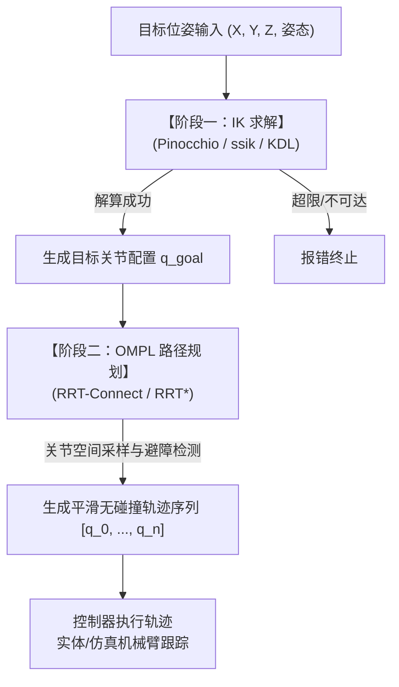

# 机械臂与全身逆运动学（IK）技术笔记

## 1. 机械臂运动学特性

Unitree G1 单臂包含 7 个旋转关节，构型为典型的人形仿生机械臂：

* **肩部 (3-DoF)**：Pitch（俯仰）+ Roll（横滚）+ Yaw（偏航）
* **肘部 (1-DoF)**：Elbow Pitch（俯仰弯曲）
* **腕部 (3-DoF)**：Roll（横滚旋转）+ Pitch（俯仰）+ Yaw（偏航）

笛卡尔空间 3D 位置与 3D 姿态共 6 个自由度约束。G1 手臂拥有 7 个关节，具有 1 个**冗余自由度（Kinematic Redundancy）**。在末端位姿固定的情况下，肘部可在空间中绕“肩-腕连线”自由摆动（即人体手臂自运动）。逆运动学（IK）解算器需针对该冗余特性进行合理约束与优化。


在默认腿部以下固定不动（Pelvis 骨盆作为绝对静止参考基座）**的前提下，整个机器人的控制空间聚焦在**上半身树状运动学链上。

**10-DoF（单臂协同）/ 17-DoF（双臂协同）躯干-手臂协同控制方案**。

---

### 一、 运动学拓扑与自由度结构

以机器人骨盆（`pelvis`）为不动根节点，向上延伸分叉为双臂：

```
                        [固定根基座: pelvis (Z=0.763m)]
                                      │
               ┌──────────────────────┴──────────────────────┐
               │    【共享躯干腰部 (Shared Waist, 3-DoF)】     │
               │   1. waist_yaw_joint   (航向左右旋转 ±150°) │
               │   2. waist_roll_joint  (横滚左右侧倾 ±30°)  │
               │   3. waist_pitch_joint (俯仰前后弯腰 ±30°)  │
               └──────────────────────┬──────────────────────┘
                                      │
                                 [torso_link]
                                      │
               ┌──────────────────────┴──────────────────────┐
               ▼                                             ▼
     【左机械臂 (7-DoF)】                           【右机械臂 (7-DoF)】
   left_shoulder_pitch/roll/yaw                   right_shoulder_pitch/roll/yaw
   left_elbow                                     right_elbow
   left_wrist_roll/pitch/yaw                      right_wrist_roll/pitch/yaw
               ▼                                             ▼
       [左手 TCP (10-DoF 链)]                         [右手 TCP (10-DoF 链)]
```

* **单臂协同模式**：$3\text{ (腰)} + 7\text{ (单臂)} = \mathbf{10\text{ DoF}}$（自由度冗余度 $N - M = 10 - 6 = 4$）
* **双臂协同模式**：$3\text{ (腰)} + 7\text{ (左)} + 7\text{ (右)} = \mathbf{17\text{ DoF}}$（双臂 12 维位姿目标，冗余度 $17 - 12 = 5$）

---

### 二、 核心控制机制：手臂优先、腰部辅助（Arm-Dominant, Waist-Assisted）

#### 痛点

如果腰部和手臂均等权重，普通解算器会频繁出现近处抓个杯子，机器人也大幅度扭腰转身的现象。不仅视觉违和，而且腰部电机拖动的是重达十几公斤的整个上半身，剧烈晃动会造成电机过热和仿真震荡。

#### 方案（三层联动）

#### 1. 非对称加权度量张量（Weighted DLS Metric Tensor）

在雅可比阻尼最小二乘中，引入**对角惩罚权重矩阵 $\mathbf{W}$**：

$$
\mathbf{W} = \text{diag}(\underbrace{w_{\text{yaw}},\ w_{\text{roll}},\ w_{\text{pitch}}}_{\text{腰部 3 关节 (大阻尼)}},\ \underbrace{w_1,\ w_2,\ \dots,\ w_7}_{\text{手臂 7 关节 (高灵敏度)}})
$$

* **参数设定**：
  $$
  w_{\text{arm}} = 1.0, \quad w_{\text{waist\_yaw}} = 8.0, \quad w_{\text{waist\_pitch}} = 10.0, \quad w_{\text{waist\_roll}} = 15.0
  $$
* **物理效果**：
  腰部转动 1 度的代价相当于手臂转动 10 度的代价！在极小值搜索中，算法会**倾尽手臂的所有活动能力去够目标；只有当手臂快伸直、再也够不着时，腰部才自然介入**。

#### 2. 零空间回正“虚拟弹簧”势场（Null-Space Home Restoring Field）

即使腰部因为大跨度动作被迫扭转，一旦目标重新移回近处，腰部必须**自动回正到直立零位**。
在次级零空间任务中注入针对腰部的二次回正梯度：

$$
\nabla H_{\text{posture}} = -\begin{bmatrix} k_{\text{waist}} \cdot \mathbf{q}_{\text{waist}} \\ k_{\text{arm}} \cdot (\mathbf{q}_{\text{arm}} - \mathbf{q}_{\text{ready}}) \end{bmatrix}
$$

* **效果**：腰部像系了一根“弹性拉簧”，无外力强求时无条件保持直立。

#### 3. 动态软死区门限（Elastic Leash Model）

* 当末端目标距肩部距离 $d \le 32\text{ cm}$（臂长 37.7 cm 的安全内圈）：
  令腰部雅可比列的增益为 0（**硬冻结腰部，只动 7 个手臂关节**，计算耗时仅需 $15\ \mu\text{s}$）。
* 当 $d > 32\text{ cm}$：
  平滑释放腰部自由度，进入 10-DoF 全局协同模式。

---

#### 升级混合逆解算器（`deploy/g1_hybrid_ik.py`）

在现有的 `G1HybridIKSolver` 基础上增加 10-DoF 链解算接口：

1. **增广关节索引映射**：
   ```python
   # URDF 模型中连续的 10-DoF 索引
   self.waist_q_indices = [12, 13, 14] # waist_yaw, waist_roll, waist_pitch
   self.left_10dof_indices = self.waist_q_indices + self.arm_q_indices["left_arm"]
   self.right_10dof_indices = self.waist_q_indices + self.arm_q_indices["right_arm"]
   ```
2. **提取 10 维空间雅可比**：
   调用 Pinocchio 的 `computeFrameJacobian`，截取这 10 个关节对应的列，直接得到 $3 \times 10$（纯位置）或 $6 \times 10$（位姿）雅可比。
3. **闭环限位硬保护**：
   将限位盒式投影扩展至 10 维：
   - `waist_yaw`: $[-2.618, 2.618]\text{ rad}$ ($\pm 150^\circ$)
   - `waist_roll`: $[-0.52, 0.52]\text{ rad}$ ($\pm 30^\circ$)
   - `waist_pitch`: $[-0.52, 0.52]\text{ rad}$ ($\pm 30^\circ$)

---

---

## 2. 常用运动学与动力学库对比

| 库名称                             | 语言支持                 | 核心原理                                  | 与 G1 的契合点与优势                                                                                                         | 安装/依赖方式                                                         |
| :--------------------------------- | :----------------------- | :---------------------------------------- | :--------------------------------------------------------------------------------------------------------------------------- | :-------------------------------------------------------------------- |
| **`Pinocchio`** *(推荐)* | C++ / Python             | 高性能刚体运动学与解析雅可比求导          | 目前四足/人形机器人运控与规划的事实标准；毫秒内计算高精度雅可比与正运动学，支持直接读取 URDF；API 现代化且 Python/C++ 一致。 | `pip install pinocchio` 或 `sudo apt install ros-jazzy-pinocchio` |
| **`TRAC-IK`**              | C++ / ROS 2              | 双线程并行：KDL 数值法 + SQP 顺序二次规划 | 解决 KDL 易陷入局部极小值和关节限位问题；将传统解算成功率从 ~80% 提升至 99% 以上。                                           | `sudo apt install ros-jazzy-trac-ik`                                |
| **`PickIK`**               | C++ / ROS 2              | 基于优化算法（支持自定义代价函数）        | MoveIt 2 官方组件；针对 7-DoF 机械臂支持注入自定义代价函数（如肘部重力下垂、手腕朝向偏好）。                                 | `sudo apt install ros-jazzy-pick-ik`                                |
| **`Orocos-KDL`**           | C++ / Python (`PyKDL`) | 经典牛顿-拉夫逊 + 雅可比伪逆              | MoveIt 默认底座，轻量且无复杂依赖；适合基础运动学链（Kinematic Chain）验证。                                                 | 系统自带 /`python3-pykdl`                                           |
| **`CasADi`**               | C++ / Python             | 符号计算与自动微分最优化框架              | 适合建模为多目标最优化问题（末端跟踪 + 避开关节限位 + 避碰）；可将 Python 优化模型自动编译为纯 C 代码。                      | `pip install casadi`                                                |
| **`OSQP / ProxQP`**        | C++ / Python             | 稀疏二次规划（QP）求解器                  | 适用于闭环逆运动学（CLIK / QP-IK）；可将关节角限位、速度限位作为严格不等式约束求解。                                         | `pip install proxsuite` / `ros-jazzy-osqp-vendor`                 |

---

## 3. 解析解与数值迭代法对比

### 3.1 解析求解库（以 `ssik` / IKFast 为代表）

`ssik` 由华盛顿大学 Personal Robotics Lab 开源，面向 6R / 7R 串联机械臂的现代解析逆运动学库。

* **技术原理**：离线阶段通过高阶符号代数消元法，将机械臂末端位姿与关节角几何方程直接求解出闭式代数公式（Closed-Form Analytical Solution）。
* **产出形态**：输入 URDF 即可离线生成独立的 Python/C++ 求解代码，运行时无大型依赖，微秒级直接输出全部解。

#### 核心优势与局限性

| 特性                 | `ssik`（闭式解析解）                                                                            | `Pinocchio / KDL`（数值迭代法）      |
| :------------------- | :------------------------------------------------------------------------------------------------ | :------------------------------------- |
| **求解耗时**   | 微秒级（约$5 \sim 20\ \mu s$）                          | 毫秒级（约$0.1 \sim 2\ \text{ms}$） |                                        |
| **解的数量**   | 一次性返回全部代数分支解（通常 8~16 组）                                                          | 每次仅沿给定初始种子收敛至 1 组局部解  |
| **收敛稳定性** | 100% 确定性，无迭代发散或死循环风险                                                               | 奇异点或极端限位附近可能发散或超时     |
| **依赖与部署** | 离线生成单文件纯代码，无外部依赖                                                                  | 依赖计算图引擎或动态链接库             |
| **局限性**     | 需针对固定机构离线生成；7R 机械臂需外部给定一个自由冗余角                                         | 模型修改需重新生成；对连杆结构变化宽容 |

#### ssik 失效场景分析

解析解无解通常由几何或物理不可达导致：

| 失效原因                   | 物理与数学机理                                                                                                                                                                    |
| :------------------------- | :-------------------------------------------------------------------------------------------------------------------------------------------------------------------------------- |
| **超出物理工作空间** | 目标点超出大臂与小臂的最大展开范围（或因过近导致构型折叠干涉），代数方程判别式小于 0（实数域无解）。                                                                              |
| **关节物理限位冲突** | 理论求出的所有代数分支解均要求关节超出硬件极限（如肘部过折、手腕超转），被限位过滤全部剔除。                                                                                      |
| **冗余参数指定矛盾** | 7R 机械臂需传入一个自由冗余角（如指定肘部俯仰角$\theta_4$）。若目标点较远（手臂需充分伸展）却强制指定 $\theta_4 = 90^\circ$，几何三角形关系不满足两边之和大于第三边，报无解。 |

### 3.2 数值迭代法（以 `Pinocchio` 为代表）

Pinocchio 基于牛顿-拉夫逊（Newton-Raphson）或闭环逆运动学（CLIK）迭代：

1. 给定当前关节猜测初值 $q_0$；
2. 计算当前末端位姿与雅可比矩阵 $J(q)$；
3. 计算笛卡尔空间误差向量 $\Delta x$；
4. 阻尼最小二乘更新：$\Delta q = J^T (J J^T + \lambda^2 I)^{-1} \Delta x$；
5. 更新关节角 $q \leftarrow q + \Delta q$，重复循环直到误差收敛至阈值（如 $0.1\text{ mm}$）。

#### 数值解常见失效原因

* **局部极小值（Local Minima）**：目标函数高度非凸，梯度接近零或受限位阻挡导致迭代震荡停滞；
* **奇异点（Singularity）发散**：机械臂完全伸直或关节轴线重合时雅可比降秩，求逆引发关节速度跳变；
* **迭代超时（Timeout）**：步数达到上限仍未收敛。

### 3.3 两类方法综合对比

| 对比维度                 | `ssik`（解析解）                                               | `Pinocchio`（数值优化）                            |
| :----------------------- | :--------------------------------------------------------------- | :--------------------------------------------------- |
| **算法本质**       | 闭式多项式代数求解                                               | 梯度下降 / 阻尼牛顿迭代                              |
| **求解耗时**       | 极快（$5 \sim 20\ \mu s$） | 中等（$0.1 \sim 1\ \text{ms}$） |                                                      |
| **解的形态**       | 一次性给出全部 8~16 组分支解                                     | 根据初始种子收敛至 1 组局部解                        |
| **稳定性**         | 确定性计算，无初值敏感问题                                       | 高度依赖初始种子（Warm Start）质量                   |
| **7-DoF 冗余处理** | 需外部指定 1 个冗余自由角参数                                    | 可在零空间自然融入肘部下垂、避限位、避障等连续优化项 |
| **模型适应性**     | 机械臂运动学模型必须严格固定                                     | 支持动态调整连杆参数与 URDF                          |

---

## 4. 求解架构与种子（Seed）策略

### 4.1 混合求解架构（Hybrid / Portfolio IK Solver）

在实际机器人控制中，单一解算方法往往无法兼顾微秒级耗时与 100% 全局鲁棒性。工程上推荐采用 **「串行回退（Fallback）架构」**：

1. **主干调用解析解（如 ssik）**：利用微秒级解算能力满足高频控制；
2. **异常回退数值解（如 Pinocchio / TRAC-IK）**：当解析解因冗余角参数矛盾或边界奇异性失败时，回退至数值优化法完成兜底。

### 4.2 数值解法种子（Seed）配置策略

数值逆运动学受初值影响显著。盲目设置大量随机 Seed 会显著拉高延迟，破坏控制周期的实时性。推荐配置 **1 个主 Seed（热启动）+ 3~5 个精选 Seed（构型兜底）**。

#### 核心机理

1. **轨迹连续性与热启动（Warm Start）**：
   在 50Hz ~ 500Hz 控制循环中，相邻控制周期末端位移微小。以上一周期实际关节角作为初始 Seed，通常只需 1~3 次微调迭代（耗时 $< 0.05\text{ ms}$）即可收敛。
2. **边际效益递减（Diminishing Returns）**：
   * 1 个 Seed（当前姿态）：求解成功率约 80% ~ 85%；
   * 3 个精选 Seed：成功率提升至 95% ~ 97%；
   * 5 个精选 Seed：成功率达到 99% 以上；
   * 增加至 50 个 Seed 时，成功率提升不足 0.2%，计算耗时成倍增加。
3. **延迟预算约束（Latency Budget）**：
   周期控制对耗时抖动敏感（100Hz 对应 $10\text{ ms}$，500Hz 对应 $2\text{ ms}$）。避免无上限的多种子循环尝试导致丢帧。

#### 分级精选 Seed 实现

```python
# 优先级排序的精选 Seed 链
seeds = [
    # 1. 首选：机器人当前周期实际关节角 (Warm Start，解决高频连续运动)
    current_joint_angles,

    # 2. 次选：机械臂经典就绪位 (Ready / Home Pose，用于大跨度重规划)
    np.array([0.2, 0.2, 0.0, 0.5, 0.0, 0.0, 0.0]),

    # 3. 三选：手肘构型翻转位 (肘部关节角度取反，规避肘上/肘下死区)
    elbow_flipped_pose,

    # 4. 兜底：在关节有效限位内抽取 2 组离散位姿
    random_valid_joint_sample_1,
    random_valid_joint_sample_2,
]
```

---

## 5. 逆运动学（IK）与路径规划（OMPL / RRT）的协同机制

### 5.1 职责划分

| 对比维度           | 逆运动学（IK）                                                                                                               | 路径规划算法（OMPL / RRT）       |
| :----------------- | :--------------------------------------------------------------------------------------------------------------------------- | :------------------------------- |
| **核心职责** | 笛卡尔空间位姿映射至关节空间角度                                                                                             | 关节空间两点间无碰撞平滑路径生成 |
| **关注对象** | 静态目标点（单时刻）                                                                                                         | 连续运动轨迹（整段路径）         |
| **输入**     | 末端 6D 目标位姿（$X, Y, Z, \text{姿态}$）          | 起始角$q_{\text{start}}$、目标角 $q_{\text{goal}}$、环境碰撞网格 |                                  |
| **输出**     | 一组或多组关节角度$q = [\theta_1, \dots, \theta_7]$ | 路径路标点序列$[q_0, q_1, \dots, q_n]$                             |                                  |
| **避障检测** | 不关注路径过程避障                                                                                                           | 实时执行路径沿途碰撞检测         |

### 5.2 协同流水线



1. **第一阶段（IK 解算）**：给定末端笛卡尔空间目标，IK 解算器求出关节目标角 $q_{\text{goal}}$；若几何不可达则终止并报错。
2. **第二阶段（OMPL / 规划）**：以当前关节状态 $q_{\text{start}}$ 与目标 $q_{\text{goal}}$ 为两端，在 7 维配置空间中进行采样、扩展树枝并校验机器人本体与环境的碰撞几何，输出可执行路径。

---

## 6. 躯干-手臂协同运动（Torso-Arm Whole-Body Coordination）

将腰部 3-DoF（`waist_yaw`, `waist_roll`, `waist_pitch`）纳入运动链后，单臂自由度扩展至 10-DoF（双臂协同为 17-DoF），能够大幅扩展末端可达工作空间。

### 6.1 核心控制难点

1. **共享基座强耦合（Shared-Base Kinematic Coupling）**：
   腰部作为双臂公共基座，其位姿改变会导致双臂末端同时产生漂移。多任务或双臂协同场景下，需在腰部动作分配上达成最优折中。
2. **仿生动素分配（Effort Sharing / Arm Dominance）**：
   若不加权约束，逆解算法会将末端位移均匀分摊至腰部与手臂，造成近距离作业时频繁晃动躯干。需遵循“近处仅手臂微调、边界处躯干介入”的准则。
3. **质心与平衡约束（CoM Stability & Zero-Moment Point）**：
   G1 上半身质量接近 20 kg。腰部俯仰弯曲超 $15^\circ$ 时质心前移显著，双足站立或行走时需协同调节腿部与髋部姿态，防止前倾失稳。

### 6.2 主流控制范式

```
+-----------------------------------------------------------------------------------------+
|                               主流控制与规划方法图谱                                     |
+-----------------------------------------------------------------------------------------+
| 1. 加权自适应 DLS (Weighted DLS / Null-space) ---> 轻量极速 (<0.1ms)，易嵌入现有工程   |
| 2. 基于二次规划的全身逆运动学 (QP-based Whole-Body IK) -> 工业标准，支持强限位与平衡约束 |
| 3. 分层任务优先级架构 (Hierarchical Task-Priority / TSID) -> 严格优先级裁决多任务冲突 |
| 4. 全身模型预测控制 (Whole-Body NMPC / Loco-manipulation) -> 边走边抓，融合接触动力学  |
+-----------------------------------------------------------------------------------------+
```

#### 1. 加权自适应阻尼最小二乘法 (Weighted DLS + Task-Space Projection)

* **数学形式**：
  $$
  \Delta \mathbf{q} = \mathbf{W}^{-1} \mathbf{J}_{10}^T \left( \mathbf{J}_{10} \mathbf{W}^{-1} \mathbf{J}_{10}^T + \lambda^2 \mathbf{I} \right)^{-1} \mathbf{e}
  $$
* **实现机制**：
  - 构造对角权重矩阵 $\mathbf{W} = \text{diag}(w_{\text{waist}}, w_{\text{arm}})$，腰部权重一般设置为手臂的 $5 \sim 10$ 倍；
  - **死区门限（Dead-zone Threshold）**：当目标处于手臂舒适工作空间（如半径 $35\text{ cm}$）内时，通过零空间阻尼锁止腰部；接近关节极限或奇异位姿时逐步释放腰部自由度。

#### 2. 二次规划全身逆运动学 (QP-based Whole-Body IK)

将逆运动学建模为标准二次规划（Quadratic Program, QP）优化问题：

$$
\min_{\Delta \mathbf{q}} \quad \underbrace{\|\mathbf{J}_{\text{left}} \Delta \mathbf{q} - \dot{\mathbf{x}}_{\text{left}}\|^2}_{\text{左手跟踪}} + \underbrace{\|\mathbf{J}_{\text{right}} \Delta \mathbf{q} - \dot{\mathbf{x}}_{\text{right}}\|^2}_{\text{右手跟踪}} + \underbrace{w_{\text{waist}} \|\Delta \mathbf{q}_{\text{waist}}\|^2}_{\text{抑制腰部动作}} + \underbrace{\|\nabla H_{\text{limits}}(\mathbf{q})\|^2}_{\text{限位排斥势场}}
$$

$$
\text{s.t.} \quad \mathbf{q}_{\min} \le \mathbf{q} + \Delta \mathbf{q} \le \mathbf{q}_{\max}, \quad |\Delta \mathbf{q}| \le \dot{\mathbf{q}}_{\max} \Delta t, \quad \mathbf{J}_{\text{CoM}} \Delta \mathbf{q} \in \mathcal{S}_{\text{support}}
$$

* **核心优势**：原生支持硬性不等式约束（关节限位、速度限位、支撑多边形质心投影约束）。

#### 3. 分层任务优先级架构 (Hierarchical Task-Priority / TSID)

通过严格的零空间多级投影链保证高优先级任务不被低优先级破坏：

* **Priority 1（安全层）**：关节防超限、自碰撞规避、双足质心平衡；
* **Priority 2（主操作层）**：主操作手末端 6D 位姿精确跟踪；
* **Priority 3（副操作层）**：副手末端跟踪（若与腰部冲突，副手让步）；
* **Priority 4（仿生姿态层）**：腰部直立回正、肘部自然下垂。

---

### 6.3 加权 DLS 与 QP 架构深度对比

```
+----------------------------------------------------------------------------------------------------+
|                                    两种求解架构对比                                                 |
+----------------------------------------------------------------------------------------------------+
| 【加权 DLS + 零空间】 (等式最小二乘 + 事后截断)                                                        |
|   1. 目标：解析矩阵求逆一步到位 Δq = W⁻¹ Jᵀ (J W⁻¹ Jᵀ + λ²I)⁻¹ e                                      |
|   2. 限位：算完之后强行截断 q = clip(q + Δq, min, max)  <-- (截断会破坏末端实际运动方向)             |
|                                                                                                    |
| 【QP 二次规划】 (不等式凸优化 + 事前感知限位)                                                          |
|   1. 目标：min ½ ‖J Δq - e‖² + ½ ‖Δq - q_ref‖²                                                     |
|   2. 限位：预先写入约束条件 q_min ≤ q + Δq ≤ q_max       <-- (提前感知限位，自动由其他冗余关节补偿)   |
+----------------------------------------------------------------------------------------------------+
```

#### 适用场景差异分析

1. **关节极限边缘的“截断畸变”**：
   - DLS 求解无视限位，依赖事后 `clip`。截断会改变实际速度向量合成方向，导致求解器在边界震荡卡死；
   - QP 预置不等式边界，在单关节受限时自动通过其余关节补偿运动，保证末端严格沿规划方向前行。
2. **双臂争夺单腰资源冲突**：
   - DLS 只能叠加雅可比或误差，易导致腰部停滞在两端都不满足的死区；
   - QP 可配置松弛变量与软/硬约束优先级，优先满足高优先级任务。
3. **自碰撞规避（Self-Collision Avoidance）**：
   - QP 可直接将几何安全距离不等式线性化为硬约束：$\mathbf{n}^T \mathbf{J}_{\text{rel}} \Delta \mathbf{q} \ge d_{\text{safe}} - d_{\text{current}}$。

#### 选型建议

| 需求场景                                    | 推荐算法                         | 单次求解耗时                  | 依赖环境                     | 选型评估                     |
| :------------------------------------------ | :------------------------------- | :---------------------------- | :--------------------------- | :--------------------------- |
| **单臂 10-DoF 点对点抓取 / 连续跟踪** | **加权 DLS + 零空间**      | **$< 0.1\text{ ms}$** | 仅需 Numpy + Pinocchio       | 零新依赖，性价比最高         |
| **双臂 17-DoF 协同作业**              | **QP（如 Pink / ProxQP）** | $0.3 \sim 0.8\text{ ms}$    | `qpsolvers` / `pin-pink` | 必须采用 QP 协调单基座竞争   |
| **严格肢体防自碰撞 (Self-Collision)** | **QP（二次规划）**         | $0.5 \sim 1.0\text{ ms}$    | 结合凸包网格距离库           | 必须采用 QP 实现不等式硬防撞 |

---

### 6.4 顶尖开源项目与框架调研

| 开源项目                                                         | 开发团队 / 机构         | 技术底座                                 | 核心特性与适配评估                                                                                                                                                      |
| :--------------------------------------------------------------- | :---------------------- | :--------------------------------------- | :---------------------------------------------------------------------------------------------------------------------------------------------------------------------- |
| **[Pink](https://github.com/stephane-caron/pink)**          | Stéphane Caron (INRIA) | **Python + Pinocchio + qpsolvers** | ⭐⭐⭐⭐⭐**首推（极佳适配）**：专为人形机器人设计的微秒级 QP 全身逆运动学，原生对接 Pinocchio，支持 `FrameTask`、`PostureTask`、`ComTask` 多任务权重配置。 |
| **[Mink](https://github.com/kevinzakka/mink)**              | Kevin Zakka             | **Python + MuJoCo**                | ⭐⭐⭐⭐⭐**首推（MuJoCo 原生）**：Pink 在 MuJoCo 生态中的移植版本，直接传入 `mjModel` 与 `mjData`，便于仿真与真实部署统一。                                  |
| **[G1Pilot](https://github.com/hucebot/g1pilot)**           | 社区开源 (G1 专属)      | **ROS 2 + Unitree SDK**            | ⭐⭐⭐⭐：面向 Unitree G1 的上半身笛卡尔控制包，下半身保留官方步态控制器，上半身通过笛卡尔 IK 联动双臂与腰部。                                                          |
| **[G1_deploy](https://github.com/yifeichen2024/G1_deploy)** | 社区开源 (G1 专属)      | **Pinocchio + CasADi / OSQP**      | ⭐⭐⭐⭐：针对 G1 双臂与灵巧手协同的部署库，内置基于 Pinocchio 优化的腰臂协同求解器。                                                                                   |
| **[TSID](https://github.com/stack-of-tasks/tsid)**          | LAAS-CNRS               | **C++ / Python + Pinocchio**       | ⭐⭐⭐⭐：任务空间逆动力学工业级旗舰库，被广泛用于 Talos 等人形机器人，擅长严格分层任务裁决。                                                                           |
| **[BioIK](https://github.com/TAMS-Group/bio_ik)**           | 汉堡大学 / TUM          | **ROS 2 MoveIt 2 C++ 插件**        | ⭐⭐⭐⭐：基于多目标生物演化算法的 MoveIt 求解器，天生适配树状链超冗余逆解。                                                                                            |
| **[Crocoddyl](https://github.com/loco-3d/crocoddyl)**       | LAAS-CNRS / Oxford      | **Pinocchio 原生 DDP**             | ⭐⭐⭐：支持全身动态移动操作（Loco-manipulation），能够解算电机力矩轨迹，但开发维护门槛较高。                                                                           |

---

### 6.5 Unitree G1 落地实现方案

项目环境（Python 3.10 + Pinocchio 4.1.0 + MuJoCo 仿真 + MoveIt 2）：

#### 方案 A：渐进式加权 10-DoF 混合求解（首阶段快速落地）

直接在现有的 `deploy/g1_hybrid_ik.py` 内部扩展：

1. **扩展雅可比子空间**：
   将单臂从 7 维扩展为 10 维状态向量：

   $$
   \mathbf{q}_{10} = [\underbrace{q_{\text{yaw}}, q_{\text{roll}}, q_{\text{pitch}}}_{\text{腰部 3 关节 (索引 12~14)}}, \underbrace{q_1, q_2, \dots, q_7}_{\text{手臂 7 关节 (索引 15~21)}}]
   $$
2. **配置分层惩罚权重矩阵**：

   $$
   \mathbf{W} = \text{diag}(10.0, 10.0, 10.0, 1.0, 1.0, 1.0, 1.0, 1.0, 1.0, 1.0)
   $$

   腰部权重为 10，手臂权重为 1，驱动求解器优先调用手臂关节运动。
3. **零空间直立势场**：
   在零空间次级任务中施加腰部向原点回正的弹簧力矩 $-\nabla H_{\text{waist}} = -0.5 \cdot \mathbf{q}_{\text{waist}}$，保证末端在舒适范围内时腰部保持直立。

#### 方案 B：基于 `mink` / `pink` 的 QP 全身逆运动学

通过 `pip install mink` 或 `pip install pin-pink` 构建标准 QP 求解：

```python
import mink

configuration = mink.Configuration(model)
tasks = [
    # 任务 1: 手腕末端高精度 6D 位姿跟踪 (权重 10.0)
    mink.FrameTask(frame_name="left_wrist_yaw_link", target_pose=target_T, weight=10.0),
    # 任务 2: 腰部保持直立参考姿态 (权重 1.0，软约束)
    mink.PostureTask(model, cost={"waist_pitch_joint": 5.0, "waist_yaw_joint": 2.0}),
    # 任务 3: 质心高度与姿态保持
    mink.ComTask(cost=1.0),
]
# 在关节物理限位与速度极限硬约束下求解
vel = mink.solve_ik(configuration, tasks, rate=50.0, solver="quadprog")
```
